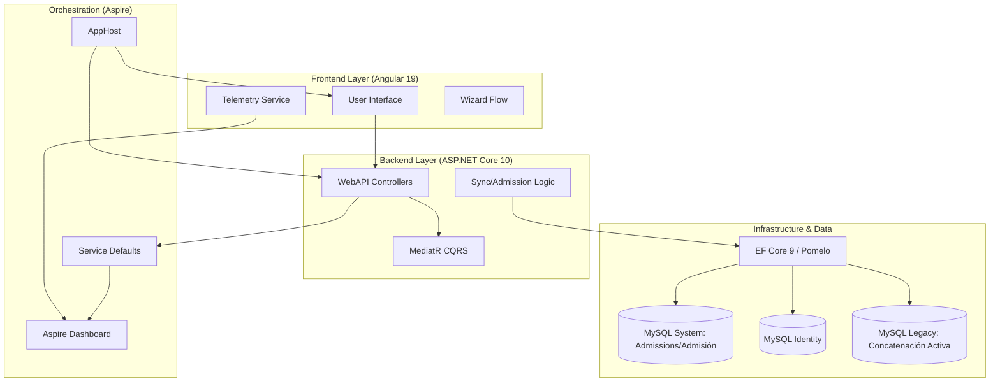

# 🏁 Mapa Maestro de Arquitectura (Architecture.md)

Este es el **Índice de Inteligencia de Alto Nivel** del Sistema Sat Hospitalario. Sirve como el "Cerebro" del proyecto, proporcionando la visión macro y conectando todos los componentes técnicos.

## 🏗️ Visión General del Sistema
El sistema es una plataforma de gestión hospitalaria moderna diseñada para orquestar la admisión, facturación y seguimiento de pacientes en un entorno distribuido y altamente observable.

### 🧩 Arquitectura de Alto Nivel (Mermaid) - V11.8

## 🛠️ Matriz de Tecnologías y Versiones
| Componente | Tecnología | Versión | Propósito |
| :--- | :--- | :--- | :--- |
| **Orquestador** | .NET Aspire | v10.0 (Preview) | Orquestación de servicios y observabilidad. |
| **Backend** | ASP.NET Core | v10.0 | API REST y servicios de negocio. |
| **Frontend** | Angular | v19.2.0 | SPA con Signals y Standalone components. |
| **Persistencia** | EF Core | v9.0.2 | ORM con soporte para MySQL (Pomelo). |
| **Backend (Legacy)** | .NET Framework | v4.8 | Librerías de conexión y lógica WinForms heredada. |
| **Base de Datos** | MySQL | v8.0+ | Almacenamiento distribuido (System, Identity, Legacy). |
| **Telemetría** | OpenTelemetry | v1.x (SDK) | Trazas, métricas y logs estructurados. |

## 🎨 Principios de Diseño Maestro (Strategic Rules)
1. **Admission Atomicity**: Cada sincronización de carrito genera un ingreso clínico y contable único.
2. **Conditional Closure**: El cierre de cuentas está supeditado al balance cero.
3. **Legacy Concatenation**: Identidad dual entre el sistema nativo y el sistema WinForms MySQL.
4. **Automated Zero-Touch Deployments**: El WebAPI consolida múltiples Contextos de BD (Identity, System, Legacy). La aplicación invoca iterativamente colecciones de:
- `DatabaseProvider`: `MySql`
- `AllowedOrigins`: Lista de orígenes permitidos separada por comas (Ej: `https://localhost:4200,https://app.sathospital.com`).
`IDatabaseInitializer` ejecutando `MigrateAsync()` en cascada para asentar los metadatos SQL antes de abrir los puertos HTTP.

## 📚 Módulos de Memoria (Deep Context)
Para un análisis profundo sin re-análisis redundante, consulta los archivos especializados:

1. **[Leyes y Estándares (Rules.md)](Rules.md)**: Naming, HSL, patrones CQRS, logs de diseño.
2. **[Flujo de Datos (DataFlow.md)](DataFlow.md)**: Pasos del Wizard de facturación y rutas de telemetría.
3. **[Configuración Técnica (Parameters.md)](Parameters.md)**: Endpoints, variables de entorno y mapeo de bases de datos.
4. **[Estado de Verificación (Checks.md)](Checks.md)**: Checklist granular de QA para cada nivel de la app.
5. **[Performance de IA (Metrics.md)](Metrics.md)**: Registro histórico de efectividad y consumo del agente.
6. **[Registro de Acción (StepJournal.md)](StepJournal.md)**: Diario técnico detallado de micro-contexto.

## 📍 Puntos de Control Macro (Paths Críticos)
- **Host**: `src/SistemaSatHospitalario.AppHost/AppHost.cs`
- **Core Logic**: `src/SistemaSatHospitalario.Core.Application/`
- **Admission Module**: `src/SistemaSatHospitalario.Core.Application/Commands/Admision/`
- **Data Access**: `src/SistemaSatHospitalario.Infrastructure/Persistence/`
- **Frontend Core**: `src/SistemaSatHospitalario.Frontend/src/app/core/`
- **Billing Module**: `src/SistemaSatHospitalario.Frontend/src/app/features/admision/facturacion/` (Arquitectura Smart/Dumb V9.0)

## 🤖 AI Workflow & Orchestration (V1.0)
El sistema utiliza un **Orquestador Maestro** para gestionar la interacción entre el agente y el código:

1. **[Orquestador de Skills](file:///c:/Src/src/Sistema2020Excelencia/agent/skills/orquestador-de-skills/SKILL.md)**: Decide la estrategia, selecciona las herramientas y recomienda el modelo (Flash, Pro, Sonnet, Opus).
2. **Context First**: Siempre se invoca la `memoria-de-arquitectura` antes de cambios estructurales para orquestar los archivos de contexto necesarios.
3. **Model Tiering**:
   - **Flash**: Velocidad y comandos.
   - **Pro**: Análisis masivo y contexto profundo.
   - **Sonnet/Opus**: Codificación de alta precisión y creatividad.
4. **Skill Evolution**: El sistema identifica patrones repetitivos y sugiere nuevos skills mediante el `creador-de-skills`.

## 🔄 Phase Orchestration (V1.0)
El sistema gestiona el ciclo de vida del desarrollo mediante el **[Orquestador de Fases](file:///c:/Src/src/Sistema2020Excelencia/agent/skills/orquestador-de-fases/SKILL.md)**:

- **Estructura Estándar**: Sigue patrones industriales (`Core.Domain`, `Core.Application`, `Infrastructure`).
- **Manejo de Bugs**: Cada error detectado se registra en el **[Log de Bugs (Bugs.md)](file:///c:/Src/src/Sistema2020Excelencia/agent/docs/Bugs.md)**.
- **Interacción**: El agente pregunta al usuario si desea corregir un error inmediatamente o guardarlo para después.
- **Transición**: Las fases avanzan progresivamente desde la definición hasta la producción.
