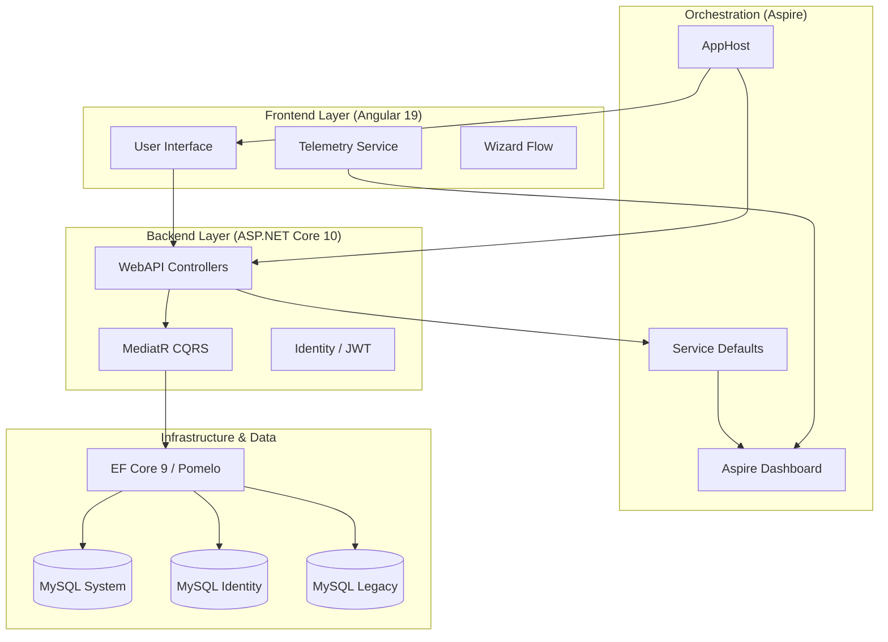

# 🏁 Mapa Maestro de Arquitectura (Architecture.md)

Este es el **Índice de Inteligencia de Alto Nivel** del Sistema Sat Hospitalario. Sirve como el "Cerebro" del proyecto, proporcionando la visión macro y conectando todos los componentes técnicos.

## 🏗️ Visión General del Sistema
El sistema es una plataforma de gestión hospitalaria moderna diseñada para orquestar la admisión, facturación y seguimiento de pacientes en un entorno distribuido y altamente observable.

### 🧩 Arquitectura de Alto Nivel (Mermaid)

## 🛠️ Matriz de Tecnologías y Versiones
| Componente | Tecnología | Versión | Propósito |
| :--- | :--- | :--- | :--- |
| **Orquestador** | .NET Aspire | v10.0 (Preview) | Orquestación de servicios y observabilidad. |
| **Backend** | ASP.NET Core | v10.0 | API REST y servicios de negocio. |
| **Frontend** | Angular | v19.2.0 | SPA con Signals y Standalone components. |
| **Persistencia** | EF Core | v9.0.2 | ORM con soporte para MySQL (Pomelo). |
| **Base de Datos** | MySQL | v8.0+ | Almacenamiento distribuido (System, Identity, Legacy). |
| **Telemetría** | OpenTelemetry | v1.x (SDK) | Trazas, métricas y logs estructurados. |

## 📚 Módulos de Memoria (Deep Context)
Para un análisis profundo sin re-análisis redundante, consulta los archivos especializados:

1. **[Leyes y Estándares (Rules.md)](Rules.md)**: Naming, HSL, patrones CQRS, logs de diseño.
2. **[Flujo de Datos (DataFlow.md)](DataFlow.md)**: Pasos del Wizard de facturación y rutas de telemetría.
3. **[Configuración Técnica (Parameters.md)](Parameters.md)**: Endpoints, variables de entorno y mapeo de bases de datos.
4. **[Estado de Verificación (Checks.md)](Checks.md)**: Checklist granular de QA para cada nivel de la app.
5. **[Performance de IA (Metrics.md)](Metrics.md)**: Registro histórico de efectividad y consumo del agente.
6. **[Registro de Acción (StepJournal.md)](StepJournal.md)**: Diario técnico detallado de micro-contexto.

## 🤖 Guía de Consumo por Agente
- **Gemini Flash**: Prioriza `Rules.md` y `Parameters.md` para ejecución rápida y precisa.
- **Gemini 3.1 Pro (High)**: Analiza `Architecture.md` y `DataFlow.md` para entender el impacto colateral de refactorizaciones grandes.
- **Gemini 3.1 Pro (Low)**: Sigue estrictamente `Checks.md` y `StepJournal.md` para tareas iterativas de mantenimiento.

## 📍 Puntos de Control Macro (Paths Críticos)
- **Host**: `src/SistemaSatHospitalario.AppHost/AppHost.cs`
- **Core Logic**: `src/SistemaSatHospitalario.Core.Application/`
- **Data Access**: `src/SistemaSatHospitalario.Infrastructure/Persistence/`
- **Frontend Core**: `src/SistemaSatHospitalario.Frontend/src/app/core/`
- **Billing Module**: `src/SistemaSatHospitalario.Frontend/src/app/features/admision/facturacion/` (Arquitectura Smart/Dumb V9.0)
