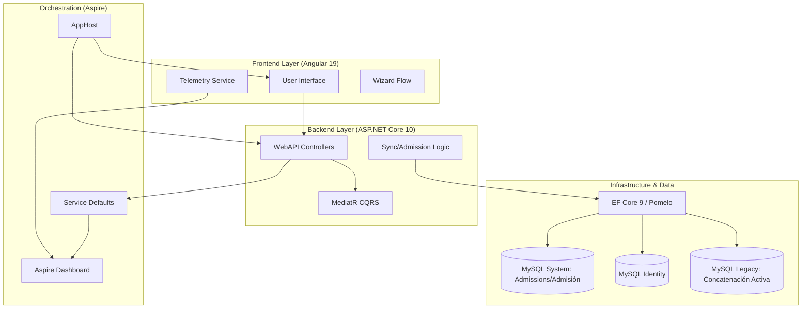

# 🏁 Mapa Maestro de Arquitectura (Architecture.md)

Este es el **Índice de Inteligencia de Alto Nivel** del Sistema Sat Hospitalario. Sirve como el "Cerebro" del proyecto, proporcionando la visión macro y conectando todos los componentes técnicos y módulos de negocio.

---

## 🏗️ Visión General del Sistema
El sistema es una plataforma de gestión hospitalaria moderna diseñada para orquestar la admisión, facturación, triage, inventario y agendamiento de pacientes en un entorno distribuido y altamente observable.

### 🧩 Arquitectura de Alto Nivel (Mermaid) - V11.8

---

## 🛠️ Matriz de Tecnologías y Versiones
| Componente | Tecnología | Versión | Propósito |
| :--- | :--- | :--- | :--- |
| **Orquestador** | .NET Aspire | v10.0 (Preview) | Orquestación de servicios y observabilidad. |
| **Backend** | ASP.NET Core | v10.0 | API REST y servicios de negocio. |
| **Frontend** | Angular | v19.2.0 | SPA con Signals y Standalone components. |
| **Persistencia** | EF Core | v9.0.2 | ORM con soporte para MySQL (Pomelo). |
| **Backend (Legacy)** | .NET Framework | v4.8 | Librerías de conexión y lógica WinForms heredada. |
| **Base de Datos** | MySQL | v8.0+ | Almacenamiento distribuido (System, Identity, Legacy). |
| **Telemetría** | OpenTelemetry | v1.x (SDK) | Trazas, métricas y logs estructurados. |

---

## 📚 Índice de Especificaciones Técnicas (Módulos del Sidebar)
Para garantizar el control paso a paso del sistema y evitar la sobrecarga de información, la especificación técnica detallada de cada secuencia de trabajo y módulo del sidebar se encuentra dividida en los siguientes archivos:

### 1. Gestión de Admisiones y Carga Clínica
*   **[Flujo de Pacientes Particulares (Particular.md)](file:///c:/Src/src/Sistema2020Excelencia/agent/docs/Architecture/Particular.md)**: Ciclo de cuenta abierta/facturada, pagos multi-moneda, y turnos de caja diaria.
*   **[Flujo de Pacientes con Convenio de Seguro (Seguro.md)](file:///c:/Src/src/Sistema2020Excelencia/agent/docs/Architecture/Seguro.md)**: Convenios de aseguradoras, cálculo de copago y generación diferida de cuentas por cobrar.
*   **[Flujo de Emergencia, Hospitalización y UCI (Emergencia_Hospitalizacion.md)](file:///c:/Src/src/Sistema2020Excelencia/agent/docs/Architecture/Emergencia_Hospitalizacion.md)**: Asignación de ubicación en tablet (boxes, habitaciones y camas), traslados de pacientes, triage clínico modular, constants vitales y carro de cargos.

### 2. Operativo y Gestión Administrativa
*   **[Control de Citas y Reservas (Control_Citas.md)](file:///c:/Src/src/Sistema2020Excelencia/agent/docs/Architecture/Control_Citas.md)**: Reservas en dos fases (15 minutos), auto-cleaner de slots expirados, agenda médica y desplazador de colisiones.
*   **[Cuentas por Cobrar y Garantías (Cuentas_Cobrar.md)](file:///c:/Src/src/Sistema2020Excelencia/agent/docs/Architecture/Cuentas_Cobrar.md)**: Receivables (AR), amortizaciones FIFO, abonos en lote y registro de garantías prendarias físicas.
*   **[Supervisor de Inventario (Inventario_Sedes.md)](file:///c:/Src/src/Sistema2020Excelencia/agent/docs/Architecture/Inventario_Sedes.md)**: Catálogo de insumos, stock por sedes, pedidos de traslado inter-sede y cierres físicos con discrepancias.
*   **[Cajas y Maestro de Servicios (Cajas_Catalogos.md)](file:///c:/Src/src/Sistema2020Excelencia/agent/docs/Architecture/Cajas_Catalogos.md)**: Arqueos de caja, declaración de saldos JSON, ABM de servicios y sugerencias de facturación dinámicas.

### 3. Gestión Médica y Auditoría
*   **[Consultas Médicas y Honorarios (Consultas.md)](file:///c:/Src/src/Sistema2020Excelencia/agent/docs/Architecture/Consultas.md)**: Suma de base + honorario médico, filtrado por especialidades en frontend y autorización/clave de supervisor.
*   **[Liquidación y Reglas de Honorarios (Honorarios_Liquidacion.md)](file:///c:/Src/src/Sistema2020Excelencia/agent/docs/Architecture/Honorarios_Liquidacion.md)**: Panel de liquidación masiva a doctores, asignaciones post-cargo y configuración de comisiones fijas vs porcentuales.
*   **[Auditoría y Modificación de Ingresos (Reportes_Operativos_Auditoria.md)](file:///c:/Src/src/Sistema2020Excelencia/agent/docs/Architecture/Reportes_Operativos_Auditoria.md)**: Consulta de expedientes de facturación, log de documentos impresos, modificación controlada de ingresos e historial de reasignación de pacientes.

### 4. Sistemas y Conectores de Infraestructura
*   **[Sincronización e Integración Legacy (Legacy.md)](file:///c:/Src/src/Sistema2020Excelencia/agent/docs/Architecture/Legacy.md)**: Sincronización Dual-Write, onboarding JIT de pacientes, órdenes de laboratorio y lock físico `FOR UPDATE` mediante Dapper.
*   **[Estudios de Rayos X y Tomografía (Rx_Tomografia.md)](file:///c:/Src/src/Sistema2020Excelencia/agent/docs/Architecture/Rx_Tomografia.md)**: Lógica del stepper `'lab-rx'`, cantidad fija 1, y excepción de honorarios de RX en Emergencia.
*   **[Configuración, RBAC y Tickets de Error (Configuracion_Sistemas.md)](file:///c:/Src/src/Sistema2020Excelencia/agent/docs/Architecture/Configuracion_Sistemas.md)**: Parámetros generales, tasa de cambio SignalR, seguridad RBAC, pruebas de instalación y visor de tickets con enmascaramiento PII.

---

## 🎨 Principios de Diseño Maestro (Strategic Rules)
1. **Admission Atomicity**: Cada sincronización de carrito genera un ingreso clínico y contable único.
2. **Conditional Closure**: El cierre de cuentas está supeditado al balance cero.
3. **Legacy Concatenation**: Identidad dual entre el sistema nativo y el sistema WinForms MySQL.
4. **Automated Zero-Touch Deployments**: El WebAPI consolida múltiples Contextos de BD ejecutando `MigrateAsync()` en cascada antes de abrir los puertos HTTP.

---

## 🤖 AI Workflow & Orchestration (V1.0)
El sistema utiliza un **Orquestador Maestro** para gestionar la interacción entre el agente y el código:
1. **[Orquestador de Skills](file:///c:/Src/src/Sistema2020Excelencia/agent/skills/orquestador-de-skills/SKILL.md)**: Decide la estrategia, selecciona las herramientas y recomienda el modelo.
2. **Context First**: Siempre se invoca la `memoria-de-arquitectura` antes de cambios estructurales para orquestar los archivos de contexto necesarios.

---

## 🔄 Phase Orchestration (V1.0)
El sistema gestiona el ciclo de vida del desarrollo mediante el **[Orquestador de Fases](file:///c:/Src/src/Sistema2020Excelencia/agent/skills/orquestador-de-fases/SKILL.md)**:
* **Estructura Estándar**: Sigue patrones industriales (`Core.Domain`, `Core.Application`, `Infrastructure`).
* **Manejo de Bugs**: Cada error detectado se registra en el **[Log de Bugs (Bugs.md)](file:///c:/Src/src/Sistema2020Excelencia/agent/docs/Bugs.md)**.
* **Transición**: Las fases avanzan progresivamente desde la definición hasta la producción.
