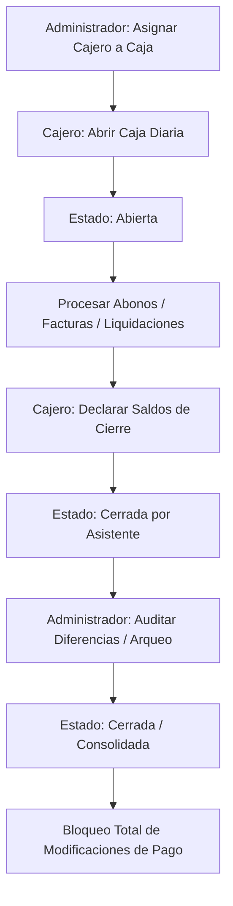

# 🏦 Especificación de Arquitectura: Cajas, Arqueos y Maestro de Servicios (Catálogos)

Este documento describe de forma exhaustiva la arquitectura técnica, el modelo de datos y el flujo operativo de los módulos de **Gestión de Cajas** y **Maestro de Servicios**.

---

## 🏗️ 1. Concepto y Ciclo de Vida del Turno de Caja

El control de los ingresos en efectivo y digitales se realiza a través de turnos diarios vinculados a cajeros específicos. Ningún abono o cobro puede registrarse en el sistema sin una caja diaria abierta.



### Maestro de Servicios y Sugerencias Dinámicas
El catálogo centraliza los códigos, descripciones y precios base en USD. Adicionalmente, permite configurar **Sugerencias Dinámicas**:
*   Si un servicio clínico es seleccionado (ej. *Estudio de Laboratorio X*), el sistema sugiere automáticamente agregar otros servicios relacionados (ej. *Toma de Muestra* o *Insumos Descartables*).
*   Estas sugerencias se configuran a nivel relacional en la entidad `ServicioSugerencia.cs`.

---

## 💾 2. Persistencia y Base de Datos (MySQL)

### Tabla de Caja Diaria: `CajasDiarias`
Almacena el estado de los turnos de caja.
```sql
CREATE TABLE `CajasDiarias` (
  `Id` CHAR(36) NOT NULL,
  `UsuarioId` VARCHAR(100) NOT NULL,
  `Estado` VARCHAR(50) NOT NULL, -- 'Abierta', 'CerradaPorAsistente', 'Cerrada'
  `FechaApertura` DATETIME NOT NULL,
  `FechaCierre` DATETIME NULL,
  `MontoApertura` DECIMAL(18,2) NOT NULL,
  `TotalCobrado` DECIMAL(18,2) NULL, -- Suma de pagos procesados
  `TotalIngresado` DECIMAL(18,2) NULL, -- Declarado por el cajero
  `DeclaracionCierreJson` TEXT NULL, -- Detalle por métodos de pago
  PRIMARY KEY (`Id`)
);
```

### Tabla de Catálogo de Servicios: `ServiciosClinicos`
Catálogo maestro de servicios, consultas e insumos del hospital.
```sql
CREATE TABLE `ServiciosClinicos` (
  `Id` CHAR(36) NOT NULL,
  `Codigo` VARCHAR(50) NOT NULL UNIQUE,
  `Descripcion` VARCHAR(250) NOT NULL,
  `PrecioUsd` DECIMAL(18,2) NOT NULL,
  `HonorarioBase` DECIMAL(18,2) NOT NULL DEFAULT 0.00,
  `Category` INT NOT NULL, -- 1: Consulta, 2: Lab, 3: Rx, 4: Medicamento, etc.
  `PermiteFraccionamiento` TINYINT(1) NOT NULL DEFAULT 0,
  PRIMARY KEY (`Id`)
);
```

---

## 🧠 3. Lógica de Backend (C# & MediatR)

### Apertura y Cierre de Caja
*   **AbrirCajaCommand**: Valida que el usuario no tenga otro turno activo de caja abierto en paralelo. Si existe, aborta.
*   **CerrarCajaCommand**:
    *   Recibe el JSON con la declaración de lo recaudado físicamente (ej: USD Zelle, USD Efectivo, Bs. Cash).
    *   Calcula el total esperado automáticamente a partir de los registros de `DetallePagos` del turno.
    *   Compara los valores esperados vs declarados, calcula sobrantes/faltantes y transiciona a `CerradaPorAsistente`.

---

## 🎨 4. Frontend y Control Operativo (Angular)

### Gestión de Cajas y Declaración de Cierre
En el componente `/cajas`, los cajeros abren y cierran su turno. Al momento de cerrar, la UI presenta un formulario estructurado por método de pago para que el cajero declare lo que tiene físicamente en gaveta o en las cuentas del banco. El backend valida y bloquea la caja, impidiendo registros retroactivos.
