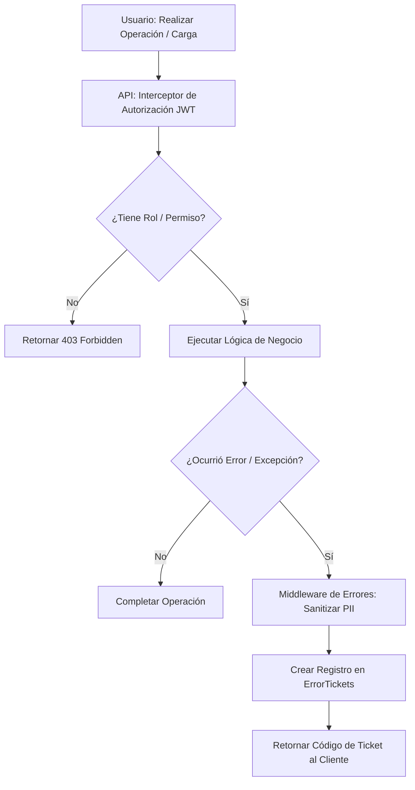

# ⚙️ Especificación de Arquitectura: Configuración General, RBAC y Tickets de Error

Este documento describe la arquitectura de los submódulos de **Configuración**, el control de accesos basados en roles (RBAC), la integridad y auditoría del sistema, y la gestión de excepciones y tickets de soporte.

---

## 🏗️ 1. Concepto y Flujo de Configuración y Seguridad

La administración y salud operativa de la plataforma depende de parámetros dinámicos (tasas de cambio, monedas) y de una política estricta de seguridad que sanitiza logs y restringe el acceso de usuarios a endpoints específicos.



### Reglas de Configuración
1. **USD-First y Tasa Cambiaria**: El sistema se rige bajo la regla **USD-First**. La tasa oficial de cambio se persiste en la tabla `TasasCambio` y se transmite reactivamente a todos los clientes web mediante SignalR.
2. **PII Scrubbing en Excepciones (SEC-008)**: Ninguna excepción que contenga datos del paciente (cédula, nombres, diagnóstico) puede guardarse en los logs de producción. La información sensible se remueve (`ScrubPii`) antes de generar el ticket.

---

## 💾 2. Persistencia y Base de Datos (MySQL)

### Tabla de Configuración General: `ConfiguracionesGenerales`
Mantiene los parámetros del sistema hospitalario.
```sql
CREATE TABLE `ConfiguracionesGenerales` (
  `Id` CHAR(36) NOT NULL,
  `Clave` VARCHAR(100) NOT NULL UNIQUE, -- Ej: 'ToleranciaCierre', 'CajeroDefecto'
  `Valor` VARCHAR(250) NOT NULL,
  `FechaActualizacion` DATETIME NOT NULL,
  PRIMARY KEY (`Id`)
);
```

### Tabla de Tasas de Cambio: `TasasCambio`
Historial de tasas cambiarias del día.
```sql
CREATE TABLE `TasasCambio` (
  `Id` CHAR(36) NOT NULL,
  `Valor` DECIMAL(18,4) NOT NULL, -- Ej: 490.04
  `FechaRegistro` DATETIME NOT NULL,
  `Activa` TINYINT(1) NOT NULL DEFAULT 1,
  PRIMARY KEY (`Id`)
);
```

### Tabla de Tickets de Error: `ErrorTickets`
Registro centralizado de excepciones del sistema.
```sql
CREATE TABLE `ErrorTickets` (
  `Id` CHAR(36) NOT NULL,
  `TicketCode` VARCHAR(50) NOT NULL UNIQUE, -- Código de soporte provisto al usuario
  `ExceptionType` VARCHAR(150) NOT NULL,
  `Message` TEXT NOT NULL, -- Mensaje sanitizado
  `StackTrace` TEXT NULL,
  `Fecha` DATETIME NOT NULL,
  PRIMARY KEY (`Id`)
);
```

---

## 🧠 3. Lógica de Backend (C# & Seguridad)

### 1. Control de Accesos (RBAC)
El backend utiliza directivas de autorización declarativa basadas en políticas y claims de JWT:
*   `[Authorize(Policy = "Permissions.Admin.AccessSettings")]`: Restringe el acceso a los controladores de configuración.
*   `[Authorize(Policy = "Permissions.Facturacion.Particular")]`: Exclusivo para cajeros de facturación de particulares.

### 2. Sanitización y Registro de Tickets
El middleware global de excepciones intercepta todos los fallos:
1. Genera un identificador único (ej: `ERR-2026-9812`).
2. Sanitiza la traza del error aplicando expresiones regulares para eliminar números de Cédula o nombres.
3. Almacena la excepción limpia en `ErrorTickets`.
4. Devuelve al frontend el JSON: `{ "Ticket": "ERR-2026-9812", "Message": "Ha ocurrido un error interno. Por favor reporte el código provisto al administrador." }`.

---

## 🎨 4. Frontend y Operación (Angular)

### Gestión de Configuración y Visor de Tickets
*   **General & Finanzas (`/settings?tab=general`)**: Permite a los administradores modificar la tasa de cambio oficial, sincronizando el valor mediante websockets a todos los cajeros activos.
*   **Seguridad & RBAC (`/settings?tab=usuarios`)**: Registro de personal clínico y administrativo, asignación de roles y permisos.
*   **Visor de Tickets (`/tickets`)**: Panel administrativo que lista las excepciones ocurridas en el sistema para facilitar la depuración, mostrando el código de ticket para que el personal de sistemas localice el log técnico sin exponer datos sensibles de pacientes en pantallas públicas.
