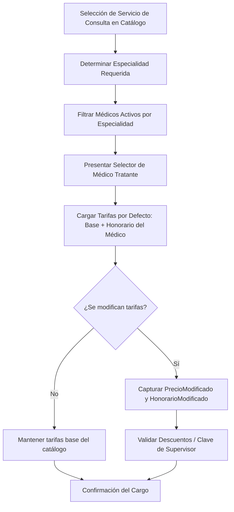

# 🩺 Especificación de Arquitectura: Consultas Médicas y Honorarios

Este documento describe la arquitectura de la lógica de negocio, reglas de cálculo y persistencia relativas a las **Consultas Médicas** y la gestión de honorarios de doctores dentro del Sistema Sat Hospitalario.

---

## 🏗️ 1. Flujo de Trabajo y Reglas de Cálculo

Las consultas médicas representan la atención brindada por médicos especialistas. El precio final facturado al paciente se calcula dinámicamente como la suma de la tasa base institucional y el honorario profesional del médico seleccionado:

$$\text{Precio Final de Consulta} = \text{Precio Base Institucional} + \text{Honorario Médico}$$



### Reglas Críticas del Ciclo de Vida
1. **Cálculo Desglosado**: La consulta no se almacena como un cargo unitario consolidado en base de datos. Se desglosa en `PrecioBase` y `Honorario` en la tabla de detalles para permitir la posterior liquidación de honorarios a los médicos.
2. **Asociación Obligatoria de Médico**: No se puede registrar una consulta sin un `MedicoId` válido asociado.

---

## 💾 2. Persistencia y Base de Datos (MySQL)

### Tabla de Médicos: `Medicos`
Almacena el registro maestro de médicos especialistas y sus honorarios base.
```sql
CREATE TABLE `Medicos` (
  `Id` CHAR(36) NOT NULL,
  `Nombre` VARCHAR(150) NOT NULL,
  `Especialidad` VARCHAR(100) NOT NULL,
  `HonorarioBase` DECIMAL(18,2) NOT NULL DEFAULT 0.00,
  `Activo` TINYINT(1) NOT NULL DEFAULT 1,
  PRIMARY KEY (`Id`)
);
```

### Tabla de Detalles de Cuenta: `DetalleCuentaServicios`
Persiste los montos de la consulta cargados a la cuenta del paciente.
```sql
CREATE TABLE `DetalleCuentaServicios` (
  `Id` CHAR(36) NOT NULL,
  `CuentaServiciosId` CHAR(36) NOT NULL,
  `ServicioId` VARCHAR(50) NOT NULL,
  `Descripcion` VARCHAR(250) NOT NULL,
  `Precio` DECIMAL(18,2) NOT NULL, -- Precio Base Institucional
  `Honorario` DECIMAL(18,2) NOT NULL, -- Honorario del Médico
  `Cantidad` DECIMAL(18,2) NOT NULL DEFAULT 1.00,
  `MedicoId` CHAR(36) NULL,
  PRIMARY KEY (`Id`),
  FOREIGN KEY (`CuentaServiciosId`) REFERENCES `CuentaServicios`(`Id`),
  FOREIGN KEY (`MedicoId`) REFERENCES `Medicos`(`Id`)
);
```

---

## 🧠 3. Lógica de Backend (C# & MediatR)

### Validación y Autorización de Modificaciones (`ValidarPrecioYClaveSupervisorAsync`)
El comando `CargarServicioACuentaCommand` recibe opcionalmente `PrecioModificado` y `HonorarioModificado`. Si los valores enviados por red difieren de las tarifas estándar del catálogo:
1. **Validación de Descuento**: Si el nuevo precio total es menor al precio oficial, el sistema calcula el porcentaje de desviación:
   $$\% \text{ Desviación} = \frac{\text{Precio Oficial} - \text{Precio Modificado}}{\text{Precio Oficial}} \times 100$$
2. **Clave de Supervisor**:
   * Si la desviación supera el umbral permitido (ej. 15%), se exige de forma mandatoria un `SupervisorKey` (Clave de Supervisor) válido.
   * Si el usuario intenta guardar una tarifa modificada sin autorización, el validador aborta la transacción y lanza una excepción `ValidationException` con el mensaje: *"Se requiere autorización del supervisor para aplicar la tarifa indicada."*

---

## 🎨 4. Frontend y Filtrado de Especialidad (Angular)

### Selector Inteligente de Médicos
En el componente de Carga Rápida (`EnfermeriaComponent`), el dropdown de médicos es reactivo y dinámico:

1. **Filtrado por Especialidad**:
   * El computed signal `medicosFiltrados` evalúa el servicio seleccionado en el Paso 1.
   * Si el servicio es una consulta (ej: *"CONSULTA GINECOLOGICA"*), extrae la especialidad mediante coincidencia de texto (ej. *"GINE"*) y filtra el listado de médicos disponibles mostrando únicamente a los ginecólogos.
   * Si es un servicio general, muestra el listado completo de médicos.
2. **Sincronización de Montos**:
   * Al seleccionar un médico, la UI recupera su `HonorarioBase` y actualiza automáticamente la señal `customHonorario`.
   * El asistente de enfermería o facturador puede reescribir tanto `customPrecio` como `customHonorario` en los inputs gigantes del Paso 2 antes de avanzar.
