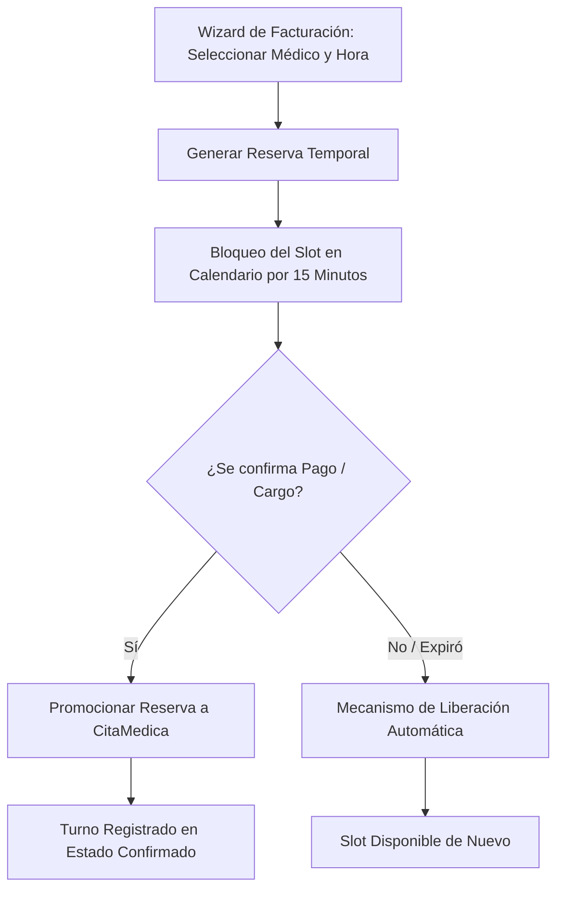

# 📅 Especificación de Arquitectura: Control de Citas y Reservas Temporales

Este documento describe la arquitectura de asignación de turnos, la prevención de colisiones en la agenda de médicos y el mecanismo de reserva temporal e inalterabilidad del calendario clínico.

---

## 🏗️ 1. Concepto y Ciclo de Vida del Agendamiento

El agendamiento médico opera bajo una arquitectura de **Reserva en Dos Fases (Two-Phase Reservation)** para evitar que dos cajeros o asistentes asignen la misma hora a dos pacientes diferentes al mismo tiempo.



### Reglas Críticas del Ciclo de Vida
1. **Reserva Temporal**: Al iniciar la configuración de la cita, se inserta una `ReservaTemporal`. Esta reserva bloquea la celda horaria en la UI para otros terminales.
2. **Expiración de Slot**: Si el paciente decide no continuar con la carga o el pago no se consolida, la reserva expira a los 15 minutos.
3. **Liberación**: Un Worker en segundo plano destruye las reservas expiradas para liberar la disponibilidad del médico.

---

## 💾 2. Persistencia y Base de Datos (MySQL)

### Tabla de Reservas Temporales: `ReservasTemporales`
Mantiene los bloqueos efímeros durante la transacción de caja.
```sql
CREATE TABLE `ReservasTemporales` (
  `Id` CHAR(36) NOT NULL,
  `MedicoId` CHAR(36) NOT NULL,
  `HoraPautada` DATETIME NOT NULL,
  `UsuarioId` VARCHAR(100) NOT NULL,
  `Comentario` VARCHAR(250) NULL,
  `ExpiracionUtc` DATETIME NOT NULL,
  PRIMARY KEY (`Id`),
  FOREIGN KEY (`MedicoId`) REFERENCES `Medicos`(`Id`)
);
```

### Tabla de Citas Médicas: `CitasMedicas`
Registra los turnos de atención consolidados.
```sql
CREATE TABLE `CitasMedicas` (
  `Id` CHAR(36) NOT NULL,
  `MedicoId` CHAR(36) NOT NULL,
  `PacienteId` CHAR(36) NOT NULL,
  `CuentaServicioId` CHAR(36) NOT NULL,
  `HoraPautada` DATETIME NOT NULL,
  `Estado` VARCHAR(50) NOT NULL, -- 'Pendiente', 'Confirmada', 'Cancelada', 'Atendida'
  `Comentario` VARCHAR(250) NULL,
  `FechaRegistro` DATETIME NOT NULL,
  `AreaClinicaId` CHAR(36) NULL,
  PRIMARY KEY (`Id`),
  FOREIGN KEY (`MedicoId`) REFERENCES `Medicos`(`Id`),
  FOREIGN KEY (`CuentaServicioId`) REFERENCES `CuentaServicios`(`Id`)
);
```

---

## 🧠 3. Lógica de Backend (C# & Workers)

### 1. Limpieza Automática (`ReservaTemporalAutoCleaner`)
Un servicio hospedado (`BackgroundService`) se ejecuta periódicamente (ej. cada 5 minutos) y realiza una eliminación directa sobre la base de datos MySQL de las reservas expiradas, evitando bloqueos residuales:
```csharp
public class ReservaTemporalAutoCleaner : BackgroundService
{
    protected override async Task ExecuteAsync(CancellationToken stoppingToken)
    {
        while (!stoppingToken.IsCancellationRequested)
        {
            using (var scope = _scopeFactory.CreateScope())
            {
                var context = scope.ServiceProvider.GetRequiredService<IApplicationDbContext>();
                
                // Ejecución directa de DELETE asíncrono para concurrencia limpia
                await context.ReservasTemporales
                    .Where(r => r.ExpiracionUtc < DateTime.UtcNow)
                    .ExecuteDeleteAsync(stoppingToken);
            }
            await Task.Delay(TimeSpan.FromMinutes(5), stoppingToken);
        }
    }
}
```

### 2. Algoritmo Desplazador de Emergencia (Minute Shifter)
En el flujo de admisiones de Emergencia, cuando se asocia una cita y existe colisión horaria estricta con una cita agendada previamente para el mismo médico, el método `ProcesarCitaMedicaAsync` desplaza la hora de la cita de 1 en 1 minuto hacia adelante hasta encontrar un espacio libre, evitando lanzar una excepción de validación que detenga el flujo clínico de urgencia.

---

## 🎨 4. Frontend de Calendario (Angular & Calendario)

### Leyendas del Calendario de Citas
La agenda médica renderiza las horas disponibles mostrando los estados interactivos obtenidos del endpoint `GET api/Citas/HorariosDisponibles`:
*   `Libre` (`EstadoConstants.LabelLibre`): Celda disponible para agendamiento.
*   `Ocupado` (`EstadoConstants.LabelOcupado`): Horario reservado por otro paciente.
*   `Tu Cita (Agregada)` (`EstadoConstants.LabelTuCita`): Horario seleccionado en la sesión activa actual de carga.
*   `En proceso de facturación...` (`EstadoConstants.LabelEnProceso`): Celda bloqueada por una `ReservaTemporal` de otro usuario.
*   `Bloqueado Administrativamente` (`EstadoConstants.LabelBloqueadoAdmin`): Espacio cancelado manualmente por la dirección del hospital.
