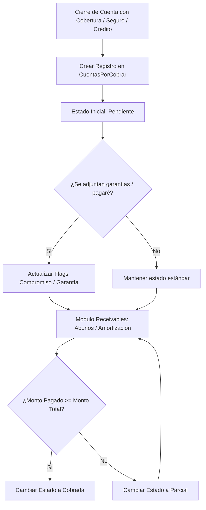

# 📂 Especificación de Arquitectura: Cuentas por Cobrar (AR - Receivables)

Este documento detalla la arquitectura técnica, persistencia de deudas, lógica de amortización y las garantías de respaldo asociadas a las **Cuentas por Cobrar (AR)** del Sistema Sat Hospitalario.

---

## 🏗️ 1. Concepto y Ciclo de Vida del Receivable

Las Cuentas por Cobrar (AR) representan créditos concedidos a pacientes particulares mediante firmas de compromiso de pago, o cobros pendientes a aseguradoras corporativas (`Convenios`).



### Reglas de Estado y Transiciones
*   **Pendiente**: Cuenta recién creada con cero abonos registrados ($\text{Monto Pagado} = 0$).
*   **Parcial**: Se han procesado pagos parciales pero el saldo es mayor a cero ($0 < \text{Monto Pagado} < \text{Monto Total}$).
*   **Cobrada**: El saldo pendiente es exactamente cero ($\text{Monto Pagado} = \text{Monto Total}$).

---

## 💾 2. Persistencia y Base de Datos (MySQL)

### Tabla de Cuentas por Cobrar: `CuentasPorCobrar`
Ubicación: [CuentaPorCobrar.cs](file:///c:/Src/src/Sistema2020Excelencia/src/SistemaSatHospitalario.Core.Domain/Entities/Admision/CuentaPorCobrar.cs)
```sql
CREATE TABLE `CuentasPorCobrar` (
  `Id` CHAR(36) NOT NULL,
  `CuentaServicioId` CHAR(36) NOT NULL,
  `PacienteId` CHAR(36) NOT NULL,
  `MontoTotalBase` DECIMAL(18,2) NOT NULL, -- Total de la deuda en USD
  `MontoPagadoBase` DECIMAL(18,2) NOT NULL DEFAULT 0.00, -- Acumulado pagado en USD
  `Estado` VARCHAR(50) NOT NULL, -- 'Pendiente', 'Parcial', 'Cobrada'
  `IsAudited` TINYINT(1) NOT NULL DEFAULT 0, -- Flag de revisión por auditoría
  `UsuarioAuditoria` VARCHAR(100) NULL,
  `FechaAuditoria` DATETIME NULL,
  `CompromisoGenerado` TINYINT(1) NOT NULL DEFAULT 0, -- Carta de compromiso firmada
  `GarantiaGenerada` TINYINT(1) NOT NULL DEFAULT 0, -- Pagaré o prenda registrada
  `QuienAutorizo` VARCHAR(150) NULL,
  `DoctorProcedimiento` VARCHAR(150) NULL,
  `InformacionAdicional` TEXT NULL,
  `FechaCreacion` DATETIME NOT NULL,
  PRIMARY KEY (`Id`),
  FOREIGN KEY (`CuentaServicioId`) REFERENCES `CuentaServicios`(`Id`)
);
```

### Tabla de Garantías Prendarias: `GarantiasItems` (Relación 1:N)
Almacena bienes físicos dejados en depósito de garantía por el paciente.
```sql
CREATE TABLE `GarantiasItems` (
  `Id` CHAR(36) NOT NULL,
  `CuentaPorCobrarId` CHAR(36) NOT NULL,
  `DescripcionBien` VARCHAR(250) NOT NULL, -- Ej: 'Vehículo Toyota Corolla 2012'
  `ValorEstimado` DECIMAL(18,2) NOT NULL,
  `EstadoGarantia` VARCHAR(50) NOT NULL, -- 'Recibido', 'Devuelto', 'Ejecutado'
  `FechaRegistro` DATETIME NOT NULL,
  PRIMARY KEY (`Id`),
  FOREIGN KEY (`CuentaPorCobrarId`) REFERENCES `CuentasPorCobrar`(`Id`)
);
```

---

## 🧠 3. Lógica de Backend (C# & MediatR)

### Procesamiento de Liquidaciones (`SettleARCommandHandler`)
La amortización o liquidación del receivable se realiza mediante el comando `SettleARCommand`:
1. **Verificación de Caja Abierta**: Todo ingreso de caja de deudores debe procesarse dentro del turno activo de una `CajaDiaria`.
2. **Registro Contable**: Crea un `DetallePagos` vinculado a la cuenta origen, calculando el valor en USD con la tasa del día.
3. **Actualización de Saldos**:
   * Suma el nuevo abono a `MontoPagadoBase`.
   * Evalúa el saldo restante:
     ```csharp
     if (MontoPagadoBase >= MontoTotalBase)
     {
         Estado = EstadoConstants.Cobrada;
     }
     else if (MontoPagadoBase > 0)
     {
         Estado = EstadoConstants.Parcial;
     }
     ```
4. **Auditoría de Cuentas**: Los administradores pueden auditar el cobro mediante `MarcarComoAuditada(usuario)`, bloqueando modificaciones adicionales en los datos de la deuda.

---

## 🎨 4. Frontend y Control de Receivables (Angular)

### Gestión de Cobros en el Módulo `/receivables`
1. **Listado Consolidado**: Muestra una cuadrícula con todas las deudas activas, coloreando en rojo las deudas `Pendiente` y en amarillo las `Parcial`.
2. **Impresión de Garantías y Cartas**: Expone botones para imprimir el Formato de Compromiso de Pago y los vales de garantía prendaria registrados (`GarantiasItems`), consumiendo el servicio global `PrintService`.
3. **Amortizaciones en Lote**: Permite seleccionar múltiples deudas de una misma aseguradora (Convenio) y aplicar un pago masivo único enviado por transferencia, distribuyendo el saldo a favor de forma secuencial en las facturas más antiguas (método FIFO).
