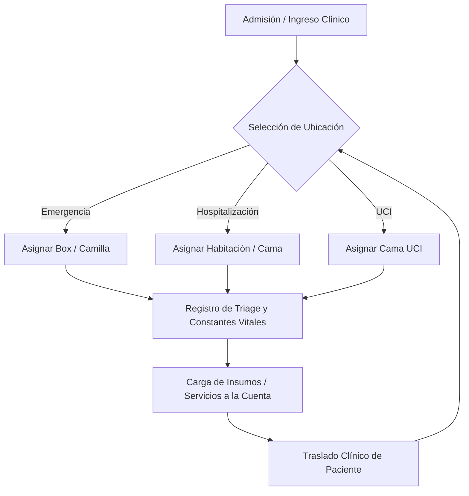

# 🏥 Especificación de Arquitectura: Emergencia, Hospitalización y UCI (Triage y Ubicaciones)

Este documento detalla de forma exhaustiva la arquitectura técnica, los componentes UI, el flujo de datos y las reglas operativas para los módulos de **Emergencia**, **Hospitalización** y **UCI (Unidad de Cuidados Intensivos)**, especificando el sistema de separación y asignación de ubicaciones físicas (camas, habitaciones y boxes).

---

## 🏗️ 1. Concepto y Separación de Áreas Clínicas

Aunque el flujo de triage y el carro de cargos son funcionalmente similares, cada área clínica posee una naturaleza operativa y de internamiento distinta:

1. **Emergencia (EMG)**: Destinada a pacientes agudos de corto plazo. Se asignan a un **Box de Observación** o Camilla temporal (ej. *Box 2*).
2. **Hospitalización (HOS)**: Destinada a pacientes de mediano/largo plazo en planta médica. Se asignan a una **Habitación** específica y cama (ej. *Habitación 113*, *Habitación 104-A*).
3. **Unidad de Cuidados Intensivos (UCI)**: Destinada a pacientes críticos. Se asignan a una **Cama de Cuidados Intensivos** con monitoreo continuo (ej. *UCI Cama 1*).



### Reglas de Ubicación y Traslados
*   **Ubicación Única Activa**: Un paciente solo puede estar asignado a una ubicación física activa en un momento dado.
*   **Historial de Ubicaciones**: Al trasladar a un paciente (ej. de Emergencia a UCI), la ubicación anterior se libera registrando la fecha y hora de egreso, y se crea un nuevo registro activo para la nueva ubicación.

---

## 💾 2. Persistencia y Base de Datos (MySQL)

### Tabla de Ubicaciones Físicas: `UbicacionesClinicas`
Registra la jerarquía y estado de disponibilidad de las camas y habitaciones.
```sql
CREATE TABLE `UbicacionesClinicas` (
  `Id` CHAR(36) NOT NULL,
  `SedeId` CHAR(36) NOT NULL,
  `AreaClinica` VARCHAR(50) NOT NULL, -- 'Emergencia', 'Hospitalizacion', 'UCI'
  `Nombre` VARCHAR(100) NOT NULL, -- Ej: 'Habitación 113', 'Cama 1', 'Box 3'
  `Disponible` TINYINT(1) NOT NULL DEFAULT 1,
  PRIMARY KEY (`Id`),
  FOREIGN KEY (`SedeId`) REFERENCES `Sedes`(`Id`)
);
```

### Tabla de Asignaciones: `AsignacionesUbicaciones`
Registra el historial de estancias físicas de los pacientes vinculados a su cuenta de servicios.
```sql
CREATE TABLE `AsignacionesUbicaciones` (
  `Id` CHAR(36) NOT NULL,
  `CuentaServiciosId` CHAR(36) NOT NULL,
  `UbicacionClinicaId` CHAR(36) NOT NULL,
  `FechaIngreso` DATETIME NOT NULL,
  `FechaEgreso` DATETIME NULL, -- NULL indica que el paciente sigue en esa cama/habitación
  `Activa` TINYINT(1) NOT NULL DEFAULT 1,
  `UsuarioAsigno` VARCHAR(100) NOT NULL,
  PRIMARY KEY (`Id`),
  FOREIGN KEY (`CuentaServiciosId`) REFERENCES `CuentaServicios`(`Id`),
  FOREIGN KEY (`UbicacionClinicaId`) REFERENCES `UbicacionesClinicas`(`Id`)
);
```

### Tabla de Historial Clínico: `TriageHistorial`
Persiste los signos vitales y la valoración física del paciente.
```sql
CREATE TABLE `TriageHistorial` (
  `Id` CHAR(36) NOT NULL,
  `CuentaServiciosId` CHAR(36) NOT NULL,
  `AsignacionUbicacionId` CHAR(36) NULL, -- Vincula el triage a la cama/habitación activa
  `MotivoConsulta` TEXT NULL,
  `TensionArterial` VARCHAR(20) NULL,
  `FrecuenciaCardiaca` INT NULL,
  `FrecuenciaRespiratoria` INT NULL,
  `Temperatura` DECIMAL(4,1) NULL,
  `SaturacionO2` INT NULL,
  `GlicemiaCapilar` INT NULL,
  `GlasgowTotal` INT NULL DEFAULT 15,
  `FechaRegistro` DATETIME NOT NULL,
  `UsuarioRegistro` VARCHAR(100) NOT NULL,
  PRIMARY KEY (`Id`),
  FOREIGN KEY (`CuentaServiciosId`) REFERENCES `CuentaServicios`(`Id`),
  FOREIGN KEY (`AsignacionUbicacionId`) REFERENCES `AsignacionesUbicaciones`(`Id`)
);
```

---

## 🧠 3. Lógica de Backend (C# & MediatR)

### Comandos de Asignación y Traslados (`TrasladarPacienteCommand`)
1. **Asignación Inicial**: Al procesar la admisión a Emergencia, Hospitalización o UCI, se ejecuta `AsignarUbicacionInicialCommand`, el cual busca una cama libre en `UbicacionesClinicas`, la marca como ocupada (`Disponible = 0`) e inserta la cabecera en `AsignacionesUbicaciones` con `Activa = 1`.
2. **Traslado de Paciente**: El comando `TrasladarPacienteCommand` gestiona la mudanza física:
   * Abre una transacción de base de datos.
   * Recupera la asignación activa actual del paciente y establece `FechaEgreso = DateTime.UtcNow` y `Activa = 0`.
   * Libera la cama anterior (`Disponible = 1`).
   * Valida la disponibilidad de la nueva ubicación.
   * Crea la nueva asignación en `AsignacionesUbicaciones` y marca la nueva cama como ocupada (`Disponible = 0`).
   * Confirma la transacción.

---

## 🎨 4. Frontend y Control Visual de Camas (Angular)

### 1. Panel de Visualización del Paciente Activo
La interfaz de enfermería en tablet muestra en la cabecera del paciente una etiqueta coloreada según su ubicación:
*   🟢 **[HOSP]** Habitación 113
*   🔴 **[UCI]** Cama 1
*   🟡 **[EMG]** Box 3

### 2. Formulario de Traslado Clínico
Un botón de "Traslado Interno" despliega un modal interactivo:
*   **Selector de Área**: Dropdown que permite alternar entre Emergencia, Hospitalización y UCI.
*   **Selector de Camas Libres**: Carga de forma reactiva las ubicaciones de la base de datos que tengan `Disponible == true` filtrando por el área seleccionada.
*   **Confirmación**: Al hacer clic en "Confirmar Traslado", envía el payload al API y recarga las señales de estado del paciente en el dashboard.

---

## 🛒 5. Comportamiento del Carrito de Carga (Emergencia, Hospitalización y UCI)

El carrito clínico de enfermería se adapta al nivel de criticidad e internamiento del paciente, flexibilizando el agendamiento médico y rigidizando el control de existencias de inventario local:

### A. Sector de Emergencia
1. **Admisión y Triage**: El ingreso exige de forma mandatoria la cumplimentación del formulario de **Triage Clínico** y signos vitales al inicio.
2. **Citas y Consultas**: Las consultas médicas de urgencia se cargan al carrito **sin especificar horario ni número de turno** (se asume atención inmediata, omitiendo reservas de agenda).
3. **Estudios de Apoyo**: Permite añadir perfiles de Laboratorio, estudios de RX y Tomografías directos al carro.
4. **Medicamentos e Insumos**: Los cargos de farmacia y descartables se cargan indicando la dosis y cantidad. La confirmación del carro ejecuta la deducción en tiempo real sobre el stock físico de la sede de origen asociada a **Emergencia** (`StockSedes` donde `Sede.Codigo = 'EMG'`).

### B. Sector de Hospitalización
1. **Admisión y Ubicación**: Exige la asignación obligatoria de **Habitación** (ej. *Habitación 113*).
2. **Triage Clínico**: El registro de constantes vitales en planta es **opcional y puede ser omitido** en el flujo de ingreso si el paciente viene referido de otro centro o se cuenta con registros externos.
3. **Citas y Consultas**: Permite registrar interconsultas médicas de especialistas en planta **sin reservar slots de tiempo ni turnos** en el calendario de citas general.
4. **Medicamentos e Insumos**: Se descuentan automáticamente del almacén o stock físico asignado a **Hospitalización** (`StockSedes` donde `Sede.Codigo = 'HOS'`).

### C. Sector de UCI (Unidad de Cuidados Intensivos)
1. **Admisión y Ubicación**: Exige la asignación obligatoria de una **Cama UCI** (ej. *UCI Cama 1*).
2. **Triage Clínico**: El registro de constantes vitales (signos vitales y valoración física detallada) es **mandatorio** debido a la naturaleza crítica del paciente.
3. **Citas y Consultas**: Las consultas médicas y visitas de intensivistas se cargan **sin requerir asignación horaria ni turno de calendario**.
4. **Medicamentos e Insumos**: Se imputan restando del inventario local exclusivo del área de **UCI** (`StockSedes` donde `Sede.Codigo = 'UCI'`).

