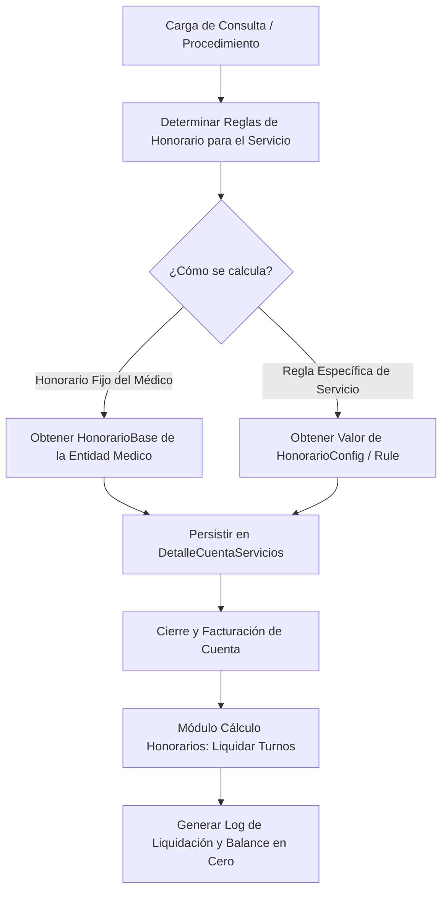

# 🩺 Especificación de Arquitectura: Configuración, Asignación y Cálculo de Honorarios Médicos

Este documento describe la arquitectura de configuración, tabulación, asignación de médicos responsables y la liquidación periódica de **Honorarios Médicos** en el Sistema Sat Hospitalario.

---

## 🏗️ 1. Concepto y Ciclo de Vida de los Honorarios

Los honorarios corresponden a los pagos devengados por los médicos por conceptos de consultas o procedimientos especializados realizados en la clínica. El sistema permite automatizar estas liquidaciones a través de reglas parametrizables en el maestro de configuración.



### Reglas de Liquidación
1. **Consolidación de Cuentas**: Los honorarios solo se consideran "liquidables" (disponibles para pago al médico) una vez que la cuenta del paciente está en estado `Facturada` (cobrada al 100%) o cuando la aseguradora ha conciliado el Receivable correspondiente.
2. **Historial de Asignaciones**: El sistema registra en `LogAsignacionHonorario` el desglose exacto de qué porcentaje o monto en USD se calculó, quién realizó el procedimiento y quién lo autorizó en caja.

---

## 💾 2. Persistencia y Base de Datos (MySQL)

### Tabla de Configuración de Honorario: `HonorarioConfigs`
Define si el honorario de un servicio clínico es un monto fijo en USD o un porcentaje sobre el precio base.
```sql
CREATE TABLE `HonorarioConfigs` (
  `Id` CHAR(36) NOT NULL,
  `ServicioId` VARCHAR(50) NOT NULL UNIQUE,
  `TipoCalculo` VARCHAR(20) NOT NULL, -- 'Fijo', 'Porcentaje'
  `Valor` DECIMAL(18,2) NOT NULL DEFAULT 0.00, -- Monto en USD o % (ej: 30.00 o 25.00)
  `FechaRegistro` DATETIME NOT NULL,
  PRIMARY KEY (`Id`)
);
```

### Tabla de Reglas Especiales: `HonorariumMappingRules`
Asociación condicional por convenio o especialidad del médico.
```sql
CREATE TABLE `HonorariumMappingRules` (
  `Id` CHAR(36) NOT NULL,
  `ConvenioId` INT NULL, -- Aplica si el paciente viene por seguro específico
  `Especialidad` VARCHAR(100) NOT NULL,
  `PorcentajeComision` DECIMAL(5,2) NOT NULL,
  PRIMARY KEY (`Id`)
);
```

---

## 🧠 3. Lógica de Backend (C# & MediatR)

### Motor de Cálculo de Honorarios
Cuando el comando de carga evalúa las tarifas:
1. **Paso 1: Configuración Directa**: Busca en `HonorarioConfigs` por `ServicioId`. Si existe de tipo `Fijo`, asigna `Valor`. Si es `Porcentaje`, asigna `PrecioBase * (Valor / 100)`.
2. **Paso 2: Regla de Mapeo**: Si no hay configuración directa, evalúa `HonorariumMappingRules` cruzando el `ConvenioId` de la cuenta del paciente y la especialidad del médico seleccionado.
3. **Paso 3: Tarifa por Defecto**: Si no hay reglas, toma el `HonorarioBase` de la entidad `Medico`.

---

## 🎨 4. Frontend y Control Administrativo (Angular)

### Submódulo de Asignaciones y Cálculo de Honorarios
*   **Cálculo de Honorarios (`/calculo-honorarios`)**:
    *   Ubicación: [admin-honorariums.component.ts](file:///c:/Src/src/Sistema2020Excelencia/src/SistemaSatHospitalario.Frontend/src/app/features/admin/honorariums/admin-honorariums.component.ts)
    *   Muestra la lista de médicos activos con el total de sus honorarios pendientes. Permite filtrar por rango de fecha y exportar el informe de liquidación en PDF.
*   **Panel de Asignaciones (`/asignaciones`)**: Permite vincular o modificar a posteriori el médico responsable de un cargo de tomografía o consulta en una cuenta, recalculando dinámicamente el honorario según las reglas activas.
*   **Configuración de Honorarios (`/config`)**: Interfaz para que la dirección del hospital cree las reglas fijas o porcentuales de los servicios clínicos.
