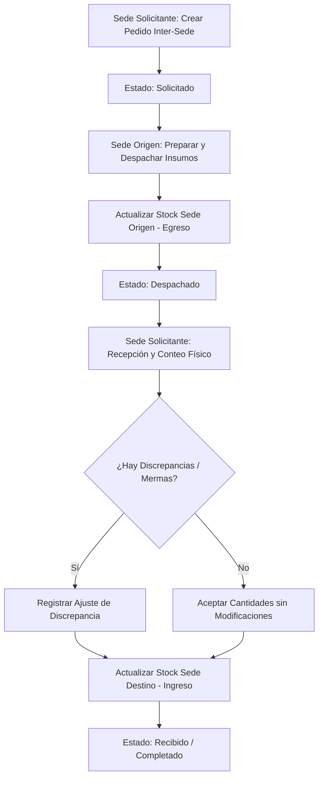

# 📦 Especificación de Arquitectura: Inventario, Sedes y Traslados (Supervisor Inventario)

Este documento detalla la arquitectura técnica, modelo relacional y flujos de negocio del submódulo **Supervisor Inventario** (Gestión de Sedes, Pedidos Inter-Sede y Control de Stock).

---

## 🏗️ 1. Concepto y Flujo de Inventario Multisede

El sistema opera bajo un modelo de inventario descentralizado y distribuido donde cada sede física del hospital controla su propio stock de insumos y medicamentos, permitiendo la transferencia controlada de existencias mediante pedidos de reabastecimiento.



### Reglas Críticas del Ciclo de Vida
1. **Pedidos FIFO**: El stock despachado sigue el principio de vencimiento o entrada original.
2. **Registro de Movimientos**: Cualquier alteración física de existencias debe generar un registro en `MovimientosInsumo` para trazabilidad de auditoría.

---

## 💾 2. Persistencia y Base de Datos (MySQL)

### Tabla de Sedes: `Sedes`
Define las sucursales físicas del hospital.
```sql
CREATE TABLE `Sedes` (
  `Id` CHAR(36) NOT NULL,
  `Nombre` VARCHAR(150) NOT NULL,
  `Codigo` VARCHAR(50) NOT NULL UNIQUE,
  `Activa` TINYINT(1) NOT NULL DEFAULT 1,
  PRIMARY KEY (`Id`)
);
```

### Tabla de Stock por Sede: `StockSedes`
Existencias en tiempo real de cada insumo en cada sucursal.
```sql
CREATE TABLE `StockSedes` (
  `Id` CHAR(36) NOT NULL,
  `SedeId` CHAR(36) NOT NULL,
  `InsumoId` CHAR(36) NOT NULL,
  `CantidadBase` DECIMAL(18,2) NOT NULL DEFAULT 0.00,
  PRIMARY KEY (`Id`),
  FOREIGN KEY (`SedeId`) REFERENCES `Sedes`(`Id`),
  FOREIGN KEY (`InsumoId`) REFERENCES `Insumos`(`Id`),
  UNIQUE KEY `UK_Sede_Insumo` (`SedeId`, `InsumoId`)
);
```

### Tabla de Traslados: `PedidosInterSede`
Cabecera de la solicitud de transferencia de insumos.
```sql
CREATE TABLE `PedidosInterSede` (
  `Id` CHAR(36) NOT NULL,
  `SedeOrigenId` CHAR(36) NOT NULL,
  `SedeDestinoId` CHAR(36) NOT NULL,
  `Estado` VARCHAR(50) NOT NULL, -- 'Solicitado', 'Despachado', 'Recibido'
  `FechaSolicitud` DATETIME NOT NULL,
  `FechaDespacho` DATETIME NULL,
  `FechaRecepcion` DATETIME NULL,
  `UsuarioSolicita` VARCHAR(100) NOT NULL,
  PRIMARY KEY (`Id`),
  FOREIGN KEY (`SedeOrigenId`) REFERENCES `Sedes`(`Id`),
  FOREIGN KEY (`SedeDestinoId`) REFERENCES `Sedes`(`Id`)
);
```

---

## 🧠 3. Lógica de Backend (C# & MediatR)

### Procesamiento de Despacho y Recepción
La mutación del inventario se gestiona mediante comandos dedicados:
1. **DespacharPedidoInterSedeCommand**:
   * Verifica la disponibilidad de stock en la sede de origen (`StockSedes`).
   * Descuenta la cantidad y registra un `MovimientoInsumo` de tipo `EgresoTraslado`.
   * Transiciona el estado del pedido a `Despachado`.
2. **RecibirPedidoInterSedeCommand**:
   * Compara la cantidad física recibida contra la despachada.
   * Si hay diferencia (ej. merma por rotura en traslado), la registra en `Discrepancias`.
   * Suma la cantidad recibida neta al stock de la sede de destino y registra un `MovimientoInsumo` de tipo `IngresoTraslado`.

---

## 🎨 4. Frontend y Operación (Angular)

### Componente de Pedidos Inter-Sede
Ubicación: [pedidos-inter-sede.component.ts](file:///c:/Src/src/Sistema2020Excelencia/src/SistemaSatHospitalario.Frontend/src/app/features/admin/inventory/pedidos-inter-sede.component.ts)

*   **Creación de Solicitudes**: El operador selecciona la sede destino, busca los insumos y define las cantidades.
*   **Gestión de Discrepancias**: Durante la recepción, la UI presenta inputs para ingresar la cantidad recibida física. Si difiere de lo despachado, resalta la discrepancia en color ámbar y exige un comentario justificativo antes de habilitar el botón de confirmación.
