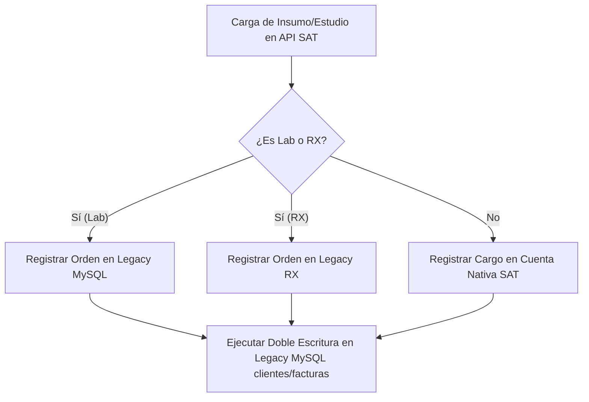

# 💾 Especificación de Arquitectura: Sincronización e Integración Legacy (MySQL)

Este documento detalla la arquitectura de sincronización bidireccional y doble escritura entre la base de datos moderna del Sistema Sat Hospitalario (Native) y el sistema heredado **Sistema2020** (Legacy MySQL).

---

## 🏗️ 1. Concepto y Sincronización Bidireccional JIT

El sistema mantiene una "identidad dual". Para evitar interrumpir las operaciones clínicas de departamentos que aún operan con el software WinForms heredado (ej. Laboratorio, Rayos X), cada transacción en la API moderna debe reflejarse en tiempo real en la base de datos `sistema2020`.



### Reglas Críticas de Sincronización
1. **Onboarding JIT (Just-In-Time)**: Si al buscar un paciente o sincronizar una orden se detecta que el paciente existe en Legacy (Cédula registrada en `sistema2020.clientes`) pero no en Native, la API consulta al repositorio heredado, recupera Nombres, Apellidos, Teléfono y Cédula, y crea de forma atómica un "stub" (paciente con GUID) en la base de datos moderna.
2. **Doble Escritura (Dual-Write)**: Cada inserción de cargos o cobros realiza commits secuenciales en el DbContext nativo y a través de repositorios legacy en MySQL. La transacción nativa solo se consolida si la inserción legacy es exitosa.

---

## 💾 2. Persistencia y Mapeo del Laboratorio

### Mapeo de Catálogo
Los servicios nativos de Laboratorio poseen un identificador en el catálogo llamado `LegacyMappingId` (que corresponde al código de examen o perfil en la base de datos antigua, ej. `"PERF-2"`).

### Tablas Legacy Involucradas (`sistema2020`)
*   **`clientes`**: Almacena los registros maestros de pacientes.
*   **`ordenes`**: Registra las órdenes de laboratorio clínico generadas en emergencias o consultas.
*   **`examenes_orden`**: Tabla de relación que asocia exámenes individuales a una orden de laboratorio.

> [!WARNING]
> **Políticas de Precios en el Legado (Ignorar Precio y PrecioDolar)**:
> Los campos de precios heredados (ej. `Precio` o `PrecioDolar` en la tabla `perfil` o mapeos heredados) **no se utilizan y deben ser totalmente ignorados**.
> El sistema legacy ha dejado de registrar de forma confiable o actualizar estos precios debido a un desfase e incompatibilidad técnica con el modelo y requerimientos de negocio actuales de la empresa. La gestión contable e impositiva de precios autoritativa reside de forma exclusiva en el sistema moderno (`SatHospitalario`).

---

## 🧠 3. Control de Concurrencia Atómica (C# & Dapper)

### Ley del Candado Físico en `NumeroDia`
En el sistema legacy, las órdenes y pacientes llevan un identificador secuencial diario (`NumeroDia`) que se reinicia a las 00:00. Para evitar que el procesamiento de múltiples solicitudes en paralelo genere colisiones de IDs y abortos de transacciones:

1. **Prohibido usar LINQ/EF Core**: EF Core no bloquea las filas adecuadamente para este tipo de cálculo atómico concurrente.
2. **Implementación con Dapper**: Se inyecta una consulta de bajo nivel en MySQL forzando el candado de lectura/escritura (`FOR UPDATE`):
   ```csharp
   using var connection = new MySqlConnection(_connectionString);
   await connection.OpenAsync();
   using var transaction = await connection.BeginTransactionAsync();
   
   // Bloqueo y lectura atómica del correlativo del día
   const string sql = @"
       SELECT COUNT(*) 
       FROM ordenes 
       WHERE DATE(Fecha) = CURDATE() 
       FOR UPDATE";
       
   var count = await connection.ExecuteScalarAsync<int>(sql, null, transaction);
   var numeroDiaSiguiente = count + 1;
   ```
3. Este candado suspende los hilos concurrentes hasta que la transacción activa realiza el commit, garantizando correlativos únicos y atómicos.
