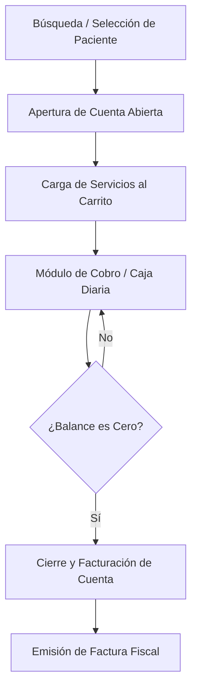

# 💳 Especificación de Arquitectura: Flujo de Pacientes Particulares

Este documento describe de forma exhaustiva la arquitectura técnica, el flujo de datos y las reglas del ciclo de vida para la admisión y facturación de pacientes de tipo **Particular** (sin cobertura de seguro).

---

## 🏗️ 1. Concepto y Ciclo de Vida del Flujo

El flujo de paciente **Particular** opera bajo el principio de pago contra prestación de servicio. A diferencia de los seguros, no hay intermediarios de cobro; el paciente asume el 100% de la responsabilidad financiera en tiempo real.



### Reglas de Ciclo de Vida
1. **Apertura de Cuenta**: Cada admisión/ingreso particular genera una nueva `CuentaServicios` en estado `Abierta` (Ley **MD-001** de `Rules.md`).
2. **Carga de Cargos**: Los servicios agregados acumulan un total en dólares ($ USD).
3. **Módulo de Pago**: El total acumulado debe liquidarse utilizando cualquiera de los métodos de pago disponibles (Efectivo, Zelle, Tarjeta, Pago Móvil) antes de permitir el egreso.
4. **Validación de Cierre**: El estado `Facturada` solo se alcanza si la diferencia entre cargos y abonos es exactamente cero (Ley **MD-002**).

---

## 💾 2. Persistencia y Base de Datos (MySQL)

### Tabla Principal: `CuentaServicios`
Almacena la cabecera de la cuenta y su estado transaccional.
```sql
CREATE TABLE `CuentaServicios` (
  `Id` CHAR(36) NOT NULL, -- GUID Novedad V11.0
  `PacienteId` CHAR(36) NOT NULL,
  `TipoIngreso` VARCHAR(50) NOT NULL, -- Valor: 'Particular'
  `Estado` VARCHAR(50) NOT NULL, -- 'Abierta', 'Facturada'
  `FechaApertura` DATETIME NOT NULL,
  `FechaCierre` DATETIME NULL,
  `UsuarioApertura` VARCHAR(100) NOT NULL,
  `Total` DECIMAL(18,2) NOT NULL DEFAULT 0.00,
  PRIMARY KEY (`Id`)
);
```

### Tabla de Abonos: `DetallePagos`
Registra los pagos parciales o totales asociados a la cuenta.
```sql
CREATE TABLE `DetallePagos` (
  `Id` CHAR(36) NOT NULL,
  `CuentaServiciosId` CHAR(36) NOT NULL,
  `CajaDiariaId` CHAR(36) NOT NULL, -- Caja donde ingresó el dinero
  `MetodoPago` VARCHAR(50) NOT NULL, -- 'Efectivo', 'Zelle', 'Tarjeta', 'PagoMovil'
  `MontoOriginal` DECIMAL(18,2) NOT NULL, -- En la moneda que se pagó (ej. Bs. o USD)
  `MontoUsd` DECIMAL(18,2) NOT NULL, -- Equivalente exacto en USD al momento del pago
  `TasaCambio` DECIMAL(18,4) NOT NULL, -- Tasa del día
  `FechaPago` DATETIME NOT NULL,
  `UsuarioPago` VARCHAR(100) NOT NULL,
  PRIMARY KEY (`Id`),
  FOREIGN KEY (`CuentaServiciosId`) REFERENCES `CuentaServicios`(`Id`)
);
```

---

## 🧠 3. Lógica de Backend (C# & MediatR)

### Proceso de Carga y Facturación
El backend procesa los pagos particulares a través de `ProcesarPagoCommand`:
1. **Validación de Caja Abierta**: Verifica que el cajero activo tenga una `CajaDiaria` en estado `Abierta` (`EstadoConstants.CajaAbierta`).
2. **Registrar Detalle de Pago**: Por cada forma de pago en el DTO, calcula el equivalente en USD aplicando la tasa de cambio activa y crea el registro `DetallePagos`.
3. **Calcular Balance**:
   $$\text{Total Cargos} = \sum (\text{Precio Base} + \text{Honorario}) \times \text{Cantidad}$$
   $$\text{Total Abonos} = \sum \text{MontoUsd en DetallePagos}$$
4. **Transición de Estado**: Si $\text{Total Cargos} - \text{Total Abonos} = 0$, actualiza `CuentaServicios.Estado` a `Facturada` y libera los bloqueos/citas médicas relacionadas.

---

## 🎨 4. Frontend y Control de Caja (Angular & Signals)

### Formulario de Pago de Caja (Multi-moneda)
El componente `PaymentModule` expone una interfaz compacta que permite introducir múltiples formas de pago en paralelo:

1. **Gestión de Tasa de Cambio**: El servicio `SettingsService` obtiene la tasa de cambio del día en tiempo real mediante SignalR (`/hub/tasa`).
2. **Conversión en Caliente**:
   * Cuando se digita un monto en Bolívares (Bs.), el frontend realiza la división reactiva para mostrar el equivalente en USD:
     $$\text{USD} = \frac{\text{Bs.}}{\text{Tasa Cambio}}$$
   * Redondea el valor en Bs. a exactamente **2 decimales** (Ley **15** de `Rules.md`).
3. **Control de Caja Diaria**:
   * Si el usuario no tiene una caja abierta, el botón de facturación se inhabilita y muestra un banner indicativo: *"Debe abrir caja antes de registrar abonos."*
   * Flujo de Cierre de Caja: El asistente solicita el cierre, la caja pasa a `CerradaPorAsistente` (Pendiente de verificación) y finalmente el Administrador consolida la caja a `Cerrada` tras auditar los montos.

---

## 🛒 5. Comportamiento del Carrito de Carga (Particular)

El carrito de compras clínico para pacientes **Particulares** exige la validación inmediata del pago o de un aval de pago diferido:

1. **Agendamiento de Consultas**:
   * Las consultas agregadas al carrito requieren de forma obligatoria la selección de **médico especialista, fecha, hora y número de turno**.
   * Genera de forma atómica una `ReservaTemporal` en la agenda del doctor.
2. **Carga de Estudios**:
   * Permite añadir exámenes de Laboratorio, RX y Tomografías directamente del catálogo al carrito.
3. **Flujo de Cierre (Checkout)**:
   * **Opción A (Pago Inmediato)**: Se digita el monto en la pasarela multi-moneda de caja. El balance neto de la cuenta debe llegar a cero para liberar el egreso.
   * **Opción B (Compromiso de Pago)**: Ante deudas no liquidadas de forma inmediata, se genera e imprime una **Carta de Compromiso de Pago** (Compromiso Contable). Esto crea un registro en `CuentasPorCobrar` y transiciona la cuenta, permitiendo al paciente retirarse con el saldo diferido.

