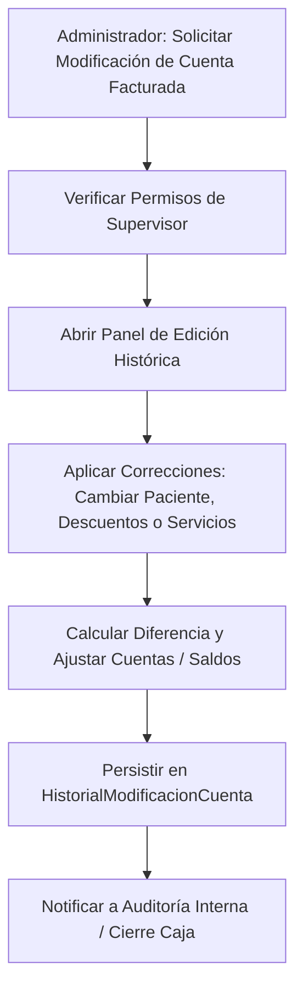

# 📊 Especificación de Arquitectura: Expedientes, Modificación de Ingresos y Auditoría

Este documento detalla la arquitectura de auditoría financiera, el historial de expedientes y el módulo de modificación controlada de ingresos históricos en el Sistema Sat Hospitalario.

---

## 🏗️ 1. Concepto y Flujo de Auditoría y Modificaciones

Para garantizar la transparencia contable y cumplir con las regulaciones de auditoría fiscal, el sistema prohíbe las modificaciones directas e invisibles sobre cuentas cerradas. Cualquier corrección administrativa de ingresos debe registrarse de manera inalterable y justificada en un log de modificaciones.



### Reglas Críticas de Auditoría
1. **Inalterabilidad de Facturas**: Los recibos de facturación fiscal (`ReciboFactura`) ya emitidos no se pueden modificar físicamente. Se debe anular el recibo anterior (`EstadoConstants.Anulada`) y generar uno nuevo.
2. **Reasignación de Pacientes**: En casos de asignaciones erróneas de cuentas en emergencias, la reasignación administrativa del paciente (`CambiarPacienteAdministrativo`) modifica la FK de paciente en la cuenta y en los detalles asociados, registrando el ID del paciente anterior y del nuevo.

---

## 💾 2. Persistencia y Base de Datos (MySQL)

### Tabla de Historial de Modificaciones: `HistorialModificacionesCuentas`
Registro inalterable de auditoría para cambios sobre cuentas cerradas/facturadas.
```sql
CREATE TABLE `HistorialModificacionesCuentas` (
  `Id` CHAR(36) NOT NULL,
  `CuentaServicioId` CHAR(36) NOT NULL,
  `UsuarioModifico` VARCHAR(100) NOT NULL,
  `FechaModificacion` DATETIME NOT NULL,
  `TipoIngresoAnterior` VARCHAR(50) NOT NULL,
  `TipoIngresoNuevo` VARCHAR(50) NOT NULL,
  `PacienteIdAnterior` CHAR(36) NOT NULL,
  `PacienteIdNuevo` CHAR(36) NOT NULL,
  `MontoAnterior` DECIMAL(18,2) NOT NULL,
  `MontoNuevo` DECIMAL(18,2) NOT NULL,
  `Justificacion` TEXT NOT NULL,
  PRIMARY KEY (`Id`),
  FOREIGN KEY (`CuentaServicioId`) REFERENCES `CuentaServicios`(`Id`)
);
```

### Tabla de Auditoría de Documentos: `DocumentLogs`
Trazabilidad de impresiones y consultas de expedientes fiscales.
```sql
CREATE TABLE `DocumentLogs` (
  `Id` CHAR(36) NOT NULL,
  `DocumentoId` CHAR(36) NOT NULL,
  `TipoDocumento` VARCHAR(50) NOT NULL, -- 'Factura', 'Recibo', 'Compromiso'
  `Accion` VARCHAR(50) NOT NULL, -- 'Impresion', 'Consulta'
  `Usuario` VARCHAR(100) NOT NULL,
  `Fecha` DATETIME NOT NULL,
  PRIMARY KEY (`Id`)
);
```

---

## 🧠 3. Lógica de Backend (C# & MediatR)

### Comando de Modificación Administrativa (`ModificarCuentaAdministrativaCommand`)
El endpoint `/admin/audit/modificar-cuenta` invoca un comando especial que ejecuta las siguientes acciones en una sola transacción:
1. **Validar Rol**: Verifica que el usuario posea permisos explícitos de `Supervisor` o `Admin`.
2. **Historial de Cambios**: Captura el estado actual de la cuenta (`CuentaServicios`) y sus relaciones.
3. **Modificación Física**: Actualiza las foreign keys (paciente) o los montos y tipos de ingreso.
4. **Guardar Log**: Escribe en `HistorialModificacionesCuentas` detallando la desviación de saldos y la justificación obligatoria.

---

## 🎨 4. Frontend y Operación (Angular)

### Panel de Modificación de Ingresos
Ubicación: [account-modification.component.ts](file:///c:/Src/src/Sistema2020Excelencia/src/SistemaSatHospitalario.Frontend/src/app/features/admin/account-modification/account-modification.component.ts)

*   **Búsqueda por Cuenta**: Permite localizar cuentas facturadas ingresando el número de cuenta o cédula del paciente.
*   **Edición Estructurada**: Habilita la alteración del tipo de ingreso (Particular a Seguro y viceversa), reasignación de paciente a través de un buscador de stubs nativos, y justificación escrita. El formulario no permite el envío si el campo de justificación se encuentra vacío.
