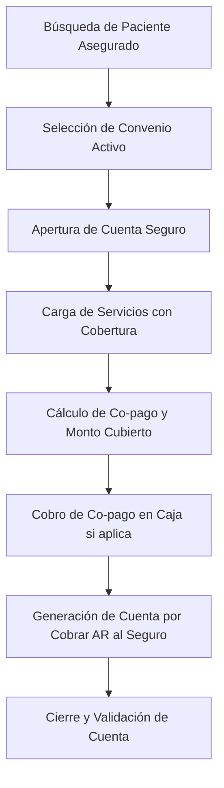

# 🛡️ Especificación de Arquitectura: Flujo de Pacientes con Convenio de Seguro

Este documento detalla de forma exhaustiva la arquitectura técnica, el modelo de datos y las reglas operativas del flujo de admisión y facturación para pacientes con **Convenio de Seguro** (asegurados).

---

## 🏗️ 1. Concepto y Ciclo de Vida del Seguro

El flujo de **Seguro** gestiona la cobertura corporativa de gastos médicos. A diferencia de los particulares, el pago principal es diferido a una cuenta por cobrar (AR) a nombre de la empresa de seguros (Convenio), pudiendo existir un copago/deducible a cargo del paciente.



### Reglas de Ciclo de Vida
1. **Asociación de Convenio**: La `CuentaServicios` debe tener un `ConvenioId` válido que enlace a un contrato activo en el maestro de convenios.
2. **Determinación de Precios**: Los precios se obtienen del catálogo de convenios pero se calculan de forma unificada sumando el precio base y el honorario médico (si aplica):
   $$\text{Precio Item} = \text{Precio Base} + \text{Honorario}$$
   $$\text{Total Cuenta} = \sum (\text{Precio Item}) \times \text{Cantidad}$$
3. **Cálculo de Copago**: El sistema calcula de forma automática:
   $$\text{Monto Cubierto} = \text{Total Cuenta} \times \text{Porcentaje Cobertura}$$
   $$\text{Monto Copago (Paciente)} = \text{Total Cuenta} - \text{Monto Cubierto}$$
4. **Cierre de Cuenta**: Al facturar, el Monto Copago se cancela en caja y el Monto Cubierto genera una nueva `CuentaPorCobrar` (AR) en estado `Pendiente`. La cuenta de servicios pasa a `Facturada`.


---

## 💾 2. Persistencia y Base de Datos (MySQL)

### Tabla de Convenios: `Convenios`
Define los contratos de seguros y sus parámetros.
```sql
CREATE TABLE `Convenios` (
  `Id` INT NOT NULL AUTO_INCREMENT,
  `Nombre` VARCHAR(150) NOT NULL,
  `Codigo` VARCHAR(50) NOT NULL UNIQUE,
  `PorcentajeCobertura` DECIMAL(5,2) NOT NULL DEFAULT 80.00,
  `Activo` TINYINT(1) NOT NULL DEFAULT 1,
  PRIMARY KEY (`Id`)
);
```

### Tabla de Cuentas por Cobrar: `CuentasPorCobrar` (AR)
Registra las deudas pendientes de conciliación por parte de las aseguradoras.
```sql
CREATE TABLE `CuentasPorCobrar` (
  `Id` CHAR(36) NOT NULL,
  `CuentaServiciosId` CHAR(36) NOT NULL,
  `ConvenioId` INT NOT NULL,
  `MontoTotal` DECIMAL(18,2) NOT NULL, -- Monto adeudado en USD
  `MontoPagado` DECIMAL(18,2) NOT NULL DEFAULT 0.00,
  `Estado` VARCHAR(50) NOT NULL, -- 'Pendiente', 'Parcial', 'Pagada'
  `FechaRegistro` DATETIME NOT NULL,
  PRIMARY KEY (`Id`),
  FOREIGN KEY (`CuentaServiciosId`) REFERENCES `CuentaServicios`(`Id`),
  FOREIGN KEY (`ConvenioId`) REFERENCES `Convenios`(`Id`)
);
```

---

## 🧠 3. Lógica de Backend (C# & MediatR)

### Generación de Receivables (`CloseAccountCommandHandler`)
Al cerrar una cuenta de tipo seguro:
1. **Calcular Coberturas**: El handler `CloseAccountCommandHandler` lee el `PorcentajeCobertura` del convenio.
2. **Procesar Copago**: Si el copago no ha sido cancelado en un 100% en caja, el cierre se bloquea con un error de validación de negocio.
3. **Crear Registro AR**: Inserta el registro en la tabla `CuentasPorCobrar` por el total del monto cubierto:
   ```csharp
   var cuentaPorCobrar = new CuentaPorCobrar(
       cuentaId: cuenta.Id,
       convenioId: cuenta.ConvenioId.Value,
       montoTotal: montoCubierto
   );
   await _context.CuentasPorCobrar.AddAsync(cuentaPorCobrar, cancellationToken);
   ```
4. **Idempotencia**: Todo este flujo está protegido bajo la directiva `[Idempotent]` para prevenir la duplicación de saldos por re-envíos de red.

---

## 🎨 4. Frontend y Conciliación (Angular & Receivables)

### Vista de Cuentas por Cobrar (AR Module)
El personal de administración gestiona las aseguradoras a través del módulo `/receivables`:

1. **Filtros por Convenio**: Permite listar las facturas adeudadas agrupadas por compañía de seguro.
2. **Liquidación Multi-moneda**: Soporta la conciliación de pagos masivos (pagos de facturas agrupadas) introduciendo transferencias bancarias en USD o Bs (calculadas con la tasa activa del día).
3. **Actualización de Saldo**:
   * Si la empresa paga el total de la deuda, el estado del receivable pasa a `Pagada` (`EstadoConstants.Pagada`).
   * Si realiza un pago menor al adeudado, el saldo se descuenta y pasa a `Parcial` (`EstadoConstants.Parcial`).

---

## 🛒 5. Comportamiento del Carrito de Carga (Seguro)

El carrito de compras clínico para pacientes con **Convenio de Seguro** se rige por las políticas de cobertura acordadas:

1. **Selección del Convenio**:
   * Al iniciar el flujo del paciente, el operador debe seleccionar la compañía de seguro.
   * La UI y el catálogo filtran y recalculan los precios del carrito aplicando el tabulador especial del convenio seleccionado.
2. **Agendamiento de Consultas**:
   * Requiere de forma obligatoria la asignación de **médico especialista, fecha, hora y número de turno**, bloqueando la celda mediante una `ReservaTemporal`.
3. **Carga de Estudios**:
   * Permite añadir exámenes de Laboratorio, RX y Tomografías del catálogo al carrito.
4. **Flujo de Copagos y Receivables**:
   * Al procesar el checkout, el sistema realiza la división atómica:
     $$\text{Monto Cobertura (AR)} = \text{Total Carrito} \times \text{Porcentaje Cobertura}$$
     $$\text{Monto Copago (Caja)} = \text{Total Carrito} - \text{Monto Cobertura}$$
   * El Monto de Cobertura se transfiere automáticamente a `CuentasPorCobrar` a nombre del Seguro, mientras que el Monto de Copago debe liquidarse en Caja Diaria por el paciente para poder facturar la cuenta.
