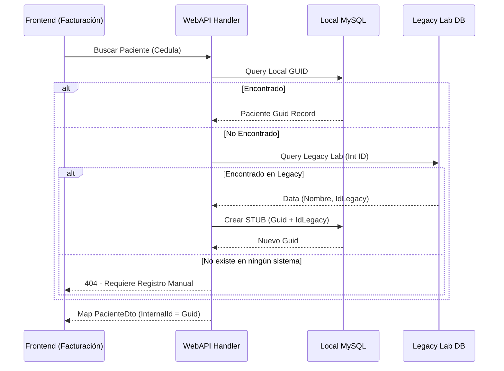

# 🔄 Flujo de Registro de Pacientes (V11.2)

1. **Local Lookup**: `_context.PacientesAdmision.FirstOrDefault(p => p.Cedula == input)`.
2. **Legacy Lookup**: Si falla local, se consulta el `ILegacyLabRepository`.
3. **Auto-Stubbing**: Si se encuentra en Legacy, se persiste localmente con un nuevo GUID y el `IdPacienteLegacy`.
4. **Respuesta**: El sistema siempre devuelve un `Guid` como `InternalId` para el resto de la transacción.

Este documento mapea la vida de la información a través del Sistema Sat Hospitalario, desde la interacción del usuario hasta la persistencia y observabilidad.

## 🏎️ Flujos de Lógica de Negocio (Workflows)
### 1. Inicio de Sesión (Auth Flow)
- **Input**: `LoginCommand` (Username, Password).
- **Proceso**: 
  - `AuthController` capta el comando.
  - `Manual Activity` iniciada en `DiagnosticsConfig.ActivitySource`.
  - `MediatR` despacha el comando al `Handler` correspondiente.
  - `IdentityDbContext` valida contra MySQL `mysql-identity`.
- **Output**: `JwtAuthResult` con token y expiración.
- **Side Effect**: Incrementar `auth.login_attempts` en el `Meter`.

## 🧪 Verificaciones de Identidad (V11.2)
- [x] **Primary Key Type**: `PacienteAdmision.Id` es `Guid`.
- [x] **Foreign Key Parity**: Todas las tablas referenciales usan `Guid PacienteId`.
- [x] **Legacy Index**: `IdPacienteLegacy` tiene un índice único en MySQL.
- [x] **Computed Mapping**: Propiedades calculadas (ej. `SaldoPendienteBase`) han sido marcadas con `.Ignore()` en el `DbContext`.
- [x] **Clean Migrations**: El historial de migraciones incluye `V11_ModernIdentity_AutoStub` con parches manuales de FKs.

### 2. Proceso de Admisión y Facturación (Wizard Flow)
Este flujo es secuencial y debe respetarse para garantizar la integridad de los datos:
1. **Paso 1: Selección de Servicios**:
   - Carga de catálogo filtrado por rol y disponibilidad.
   - Guardián de nulidad en `serviciosFiltradosPorRol`.
2. **Paso 2: Selección de Convenio**:
   - Selección del convenio (Asterisco, Descuento, etc.).
   - Mapeo de `Convenios` en la capa de persistencia `mysql-system`.
3. **Paso 3: Identificación Paciente / Pago**:
   - Búsqueda de paciente existente o creación (Solo Admin).
   - Generación de factura y recibo.
   - Cálculo automático de tasas y USD en `FacturaConvenioAsterisco`.

### 3. Proceso de Agendamiento (Scheduling Flow)
Integrado en el Wizard de Facturación (Micro-Ciclo 38):
- **Reserva Temporal**:
  - `FacturacionComponent` -> `ReservarTurnoTemporalCommand`.
  - Crea `ReservaTemporal` (15 min) para bloquear el slot mientras se procesa la cuenta.
  - Valida contra `CitasMedicas` y otras `ReservasTemporales` vigentes.
- **Persistencia de Cita**:
  - `CargarServicioACuentaCommand` -> `ProcesarCitaMedicaAsync`.
  - Crea `CitaMedica` vinculada a la `CuentaServicios`.
  - Marca estado "En Espera" por defecto.

## 📡 Arquitectura de Telemetría (Observability Flow)
El sistema utiliza un pipeline de OpenTelemetry distribuido:

1. **Recolección en Origen**:
   - **Frontend**: `telemetry.service.ts` usa OTel JS SDK para capturar clics, navegación y fallos.
   - **Backend**: `Extensions.cs` instrumenta ASP.NET Core, EF Core y HttpClient.
2. **Exportación**:
   - Ambas capas envían datos vía **OTLP HTTP/gRPC** al endpoint orquestado.
   - Endpoint: `http://localhost:18889` (Aspire Collector).
3. **Persistencia y Visualización**:
   - El **Aspire Dashboard** recibe y procesa las trazas, métricas y logs.
   - Visualización en tiempo real en `https://localhost:17196`.

## 🏗️ Mapeo de Capas (Macro-Cycle)
- **UI (Angular)** -> **API (Controllers)** -> **Application (MediatR)** -> **Domain (Entidades)** -> **Infrastructure (EF Core)** -> **Datos (MySQL)**.
- **Relación Crítica**: Los `Commands` deben ser inmutables y portar solo la información necesaria para el cambio de estado.
