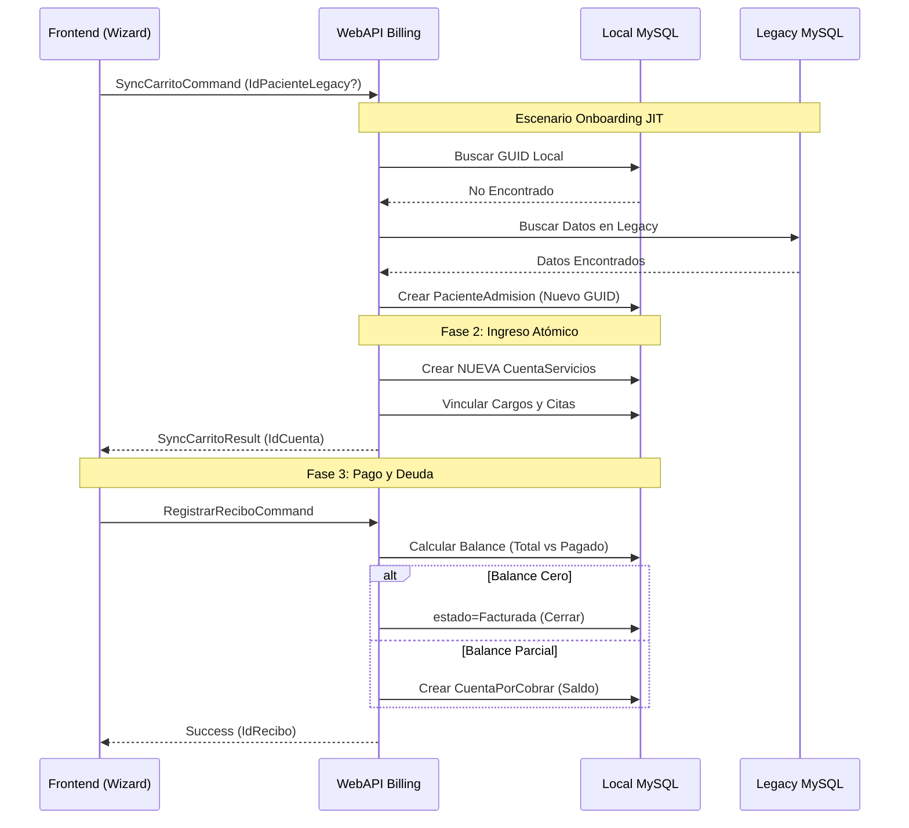

# 🔄 Flujo de Identidad e Ingreso (V11.7 Atómico)

## 🏎️ Flujos de Lógica de Negocio (Workflows) - V11.7

### 1. Admisión Atómica (SyncCarrito)
- **Input**: `SyncCarritoCommand` con `IdPacienteLegacy` opcional.
- **Proceso**: 
  - Resolución de identidad (Onboarding si es necesario).
  - **Unicidad**: Una ejecución = Una nueva `CuentaServicios`. Se ignora cualquier cuenta abierta previa.
  - Generación de folios y vinculación de médicos/citas.
- **Output**: Identificador de la nueva cuenta para el proceso de pago.

### 2. Proceso de Pago y Balance (Billing Module)
- **Validación de Caja**: Solo opera si existe una `CajaDiaria` abierta.
- **Diferenciación de Saldo**:
    - **Pago Total**: Cierra el ciclo de vida de la cuenta.
    - **Pago Parcial**: Registra el recibo y traslada el saldo a la entidad `CuentaPorCobrar`.

### 3. Registro de Pacientes (Dual-Write)
- Al registrar un paciente nuevo desde el formulario dedicado, el sistema escribe el registro maestro en la base de datos nativa y sincroniza los datos básicos en la tabla `datospersonales` de la base legacy para interoperabilidad con sistemas satélite (Laboratorio/Imagen).

## 📡 Arquitectura de Telemetría (Observability Flow)
El sistema utiliza un pipeline de OpenTelemetry distribuido:

1. **Recolección en Origen**:
   - **Frontend**: `telemetry.service.ts` usa OTel JS SDK para capturar clics, navegación y fallos.
   - **Backend**: `Extensions.cs` instrumenta ASP.NET Core, EF Core y HttpClient.
2. **Exportación**:
   - Ambas capas envían datos vía **OTLP HTTP/gRPC** al endpoint orquestado.
   - Endpoint: `http://localhost:18889` (Aspire Collector).
3. **Persistencia y Visualización**:
   - El **Aspire Dashboard** recibe y procesa las trazas, métricas y logs.
   - Visualización en tiempo real en `https://localhost:17196`.

## 🏗️ Mapeo de Capas (Macro-Cycle)
- **UI (Angular)** -> **API (Controllers)** -> **Application (MediatR)** -> **Domain (Entidades)** -> **Infrastructure (EF Core)** -> **Datos (MySQL)**.
- **Relación Crítica**: Los `Commands` deben ser inmutables y portar solo la información necesaria para el cambio de estado.
