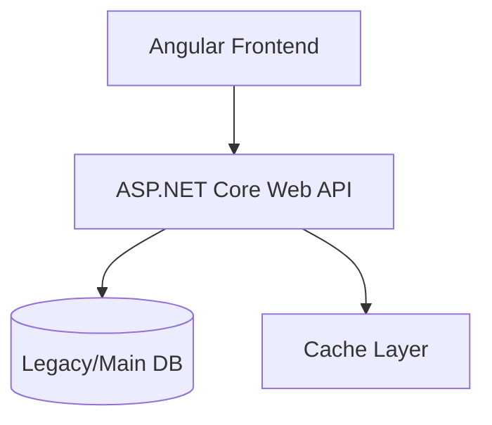

# [Project/Module Name] Technical Architecture Report
**Author**: Antigravity (Senior Microsoft Standard)
**Date**: [Date]
**Audience**: Technical Steering Committee / Senior Architecture Lead

---

## 1. Executive Summary
[Brief high-level description of the system, its business impact, and key technical achievements (3-4 sentences).]

## 2. Architectural Blueprint
[ Mermaid diagram placeholder ]

### 2.1 Design Rationale
[Explain why this architecture was chosen, focusing on scalability, maintainability, and standard patterns (REST, Microservices, etc.).]

## 3. Core Implementation Details
### 3.1 Backend Excellence (.NET)
- [Detail critical services, dependency injection strategies, and business logic encapsulation.]
- **Persistence**: High-performance EF Core mapping with optimized MySQL queries.

### 3.2 Frontend Architecture (Angular Pro)
- **State Management**: Reactive data flows using Signals for micro-optimizations in change detection.
- **Modularity**: Lean Standalone components and smart dependency injection (`inject()`).

## 4. Operational Excellence & Reliability
### 4.1 Security Framework
[Describe authentication/authorization (JWT/RBAC), data encryption, and vulnerability mitigation.]

### 4.2 Error Management & Observability
[Detail logging strategies, global exception handling, and resiliance patterns (Circuit Breaker/Retries).]

## 5. Strategic Roadmap & Recommendations
[Suggest near-term optimizations, scalability milestones, or technical debt mitigation.]
