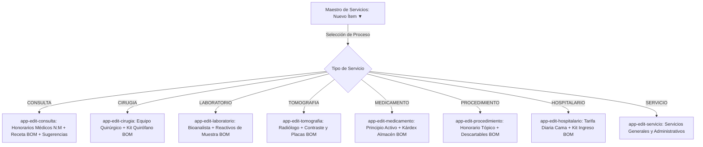

# Arquitectura: Segregación de Procesos CRUD en Catálogo y Orquestación en Maestro de Servicios

**Versión:** 4.0.13  
**Fecha:** 12 de Septiembre de 2026  
**Rama:** `modificacionCatalogoMaestro`  
**Autor:** Senior Full-Stack Architect & Lead Developer (.NET 9 + Angular 19+)

---

## 1. Resumen Ejecutivo (Executive Summary)

El módulo de Maestro de Servicios (`CatalogManagementComponent`) se refactoriza para desacoplar el antiguo flujo de creación genérico compartido y dar paso a una **arquitectura de procesos clínicos segregados**. Cada tipo de servicio (`Consulta`, `Cirugía`, `Laboratorio`, `Tomografía`, `Medicamento`, `Procedimiento`, `Estancia Hospitalaria`, `Servicio Base`) cuenta con su propio ciclo CRUD independiente, orquestado desde la barra de herramientas del maestro mediante el botón desplegable interactivo **`Nuevo Ítem ▼`**. Adicionalmente, el ciclo de eliminación lógica se transforma en un **Soft Delete con Visibilidad Persistente**, garantizando que los ítems desactivados permanezcan en la grilla de administración con indicador explícito `DESACTIVADO` y con facultad inmediata de **Reactivación**, protegiendo la integridad histórica de facturación y auditoría.

---

## 2. Segregación de los 8 Procesos CRUD

Cada categoría de servicio hospitalario responde a reglas de negocio e invariantes relacionales específicos. Al invocar la creación desde el desplegable, se activa directamente el componente especializado en modo creación (`isEditing = false`, `itemId = null`):

### Detalle de Procesos Clínicos y Operativos:
1. **Consulta Médica (`CONSULTA`)**:
   - Componente: `EditConsultaComponent`
   - Características: Honorario base USD, tarifas personalizadas por médico (`DoctorHonorarioDto`), receta de insumos de consultorio (`ServicioInsumoRecetaDto`), y servicios diagnósticos sugeridos.
2. **Cirugía / Quirófano (`CIRUGIA`)**:
   - Componente: `EditCirugiaComponent`
   - Características: Tiempos de pabellón, honorarios para cirujano principal, primer ayudante y anestesiólogo, kit de insumos quirúrgicos (suturas, compresas, descartables) con descargo unidireccional.
3. **Laboratorio Clínico (`LABORATORIO`)**:
   - Componente: `EditLaboratorioComponent`
   - Características: Honorario del bioanalista procesador, tubos de ensayo y reactivos de prueba analítica, sincronización con perfiles y catálogo legacy MySQL.
4. **Tomografía / Imágenes (`TOMOGRAFIA`)**:
   - Componente: `EditTomografiaComponent`
   - Características: Protocolos técnicos de corte, honorarios de médico radiólogo para informe, medios de contraste yodado, catéteres y placas.
5. **Medicamento / Fármaco (`MEDICAMENTO`)**:
   - Componente: `EditMedicamentoComponent`
   - Características: Principio activo, dosis y presentación, enlace estricto con el Kárdex de Almacén/Farmacia para control de existencias unidireccionales.
6. **Procedimiento Ambulatorio (`PROCEDIMIENTO`)**:
   - Componente: `EditProcedimientoComponent`
   - Características: Sala de procedimiento/emergencia, honorario de médico o técnico tratante, materiales de curación descartables.
7. **Estancia Hospitalaria (`HOSPITALARIO`)**:
   - Componente: `EditHospitalarioComponent`
   - Características: Habitación/cama (Suite, Privada, UCI), cargo diario de hospitalización, honorario médico de visita diaria, kit de admisión/lencería.
8. **Servicio General (`SERVICIO`)**:
   - Componente: `EditServicioComponent`
   - Características: Logística, traslados y servicios administrativos base.

---

## 3. Arquitectura de Soft Delete Visible y Reactivación

### Principio de No Destrucción Histórica
Las cuentas de pacientes, cierres de auditoría y facturas emitidas referencian permanentemente las claves primarias (`Guid Id`) de los servicios clínicos. Eliminar físicamente un registro causaría violaciones de integridad referencial o inconsistencias contables.

### Flujo de Estado:
1. **Desactivación (Soft Delete)**:
   - Endpoint: `DELETE api/Catalog/{id}`
   - Comando: `DeleteCatalogItemCommand`
   - Dominio: `ServicioClinico.Desactivar(usuarioId)` -> `Activo = false`, registra usuario y timestamp UTC.
   - Frontend: El ítem **no se elimina de la grilla**. Se actualiza la señal reactiva para reflejar `activo: false`.
2. **Visualización en Grilla**:
   - Filas de ítems inactivos: Renderizadas con estilo atenuado (`opacity-60`) y título tachado.
   - Badge destacado: `DESACTIVADO` en rojo (`bg-rose-500/10 border-rose-500/30 text-rose-400`).
   - Filtro de Estado en Toolbar: Selector declarativo con opciones `TODOS` (activos y desactivados), `ACTIVOS` y `DESACTIVADOS`.
3. **Reactivación**:
   - Endpoint: `PATCH api/Catalog/{id}/reactivate`
   - Comando: `ReactivateCatalogItemCommand`
   - Dominio: `ServicioClinico.Activar()` -> `Activo = true`, limpia metadatos de desactivación.
   - Frontend: Botón `Reactivar` en la columna de acciones (ícono `RotateCcw` en verde esmeralda) que restaura el ítem a activo inmediatamente.

---

## 4. Matriz de Seguridad y Segregación

- **Facturación y Admisión**: Las consultas de catálogo ejecutadas desde los módulos de cuentas de paciente y caja aplican estrictamente `IncluirInactivos = false` (`Where(s => s.Activo)`), impidiendo que personal operativo cargue servicios dados de baja.
- **Administración y Maestro de Catálogo**: La consulta administrativa invoca `api/Catalog/unified?incluirInactivos=true`, garantizando plena visibilidad de la totalidad de servicios registrados.
