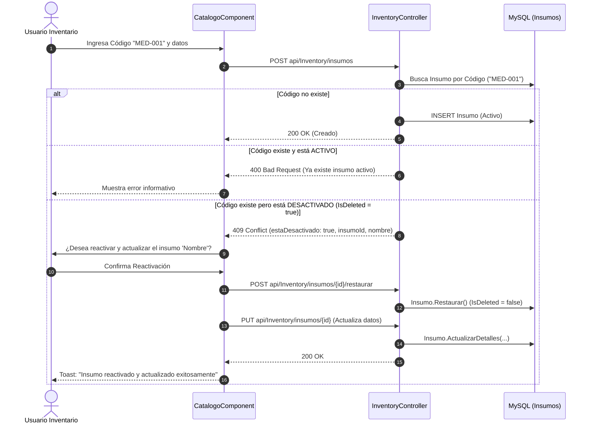

# Estrategia de Borrado Lógico (SoftDelete), Detección de Colisiones y Resiliencia de Catálogos (v4.0.9)

## 1. Resumen Ejecutivo
Este documento formaliza el estándar de **Borrado Lógico (*SoftDelete*)**, ciclo de vida de entidades maestras, prevención de colisiones de claves únicas y flujos de reactivación/restauración de catálogo en el **Sistema Sat Hospitalario**.

---

## 2. Diagnóstico del Problema y Regla de Dominio en Salud

### Principio de Inmutabilidad Histórica
En sistemas de salud y gestión hospitalaria:
- **Un código o identificador de catálogo (Insumo, Medicamento, Servicio, Médico) nunca debe borrarse físicamente de la base de datos** si ha tenido movimientos en el Kárdex, notas de entrega, órdenes quirúrgicas o detalles de cuenta.
- Si un ítem es inhabilitado (`IsDeleted = true` o `Activo = false`), su código permanece reservado para preservar la trazabilidad de auditoría histórica.

### Colisión y Reactivación Asistida
Cuando un operador intenta registrar un nuevo insumo con un código preexistente:
1. **Si el insumo está ACTIVO:** El backend rechaza con `400 Bad Request` indicando el nombre del producto activo que ocupa el código.
2. **Si el insumo está INACTIVO / DESACTIVADO:** El backend responde con `409 Conflict` estructurado con la metadata del ítem inhabilitado. El frontend intercepta esta respuesta y ofrece al operador la reactivación y actualización inmediata en un solo paso (`restoreInsumo` + `updateInsumo`).

---

## 3. Matriz de Entidades y Mecanismos de Borrado Lógico

| Entidad | Propiedad de Estado | Mecanismo de Eliminación | Método de Dominio |
| :--- | :--- | :--- | :--- |
| `Insumo` | `IsDeleted` (bool), `FechaInactivacion`, `OcultoEnTraslados` | `SoftDelete()` | `Restaurar()` |
| `ServicioClinico` | `Activo` (bool), `UsuarioDesactivacion`, `FechaDesactivacion` | `Desactivar(usuario)` | `Activar(usuario)` |
| `CategoriaInsumo` | `Activo` (bool) | `SetEstado(false)` | `SetEstado(true)` |
| `PrincipioActivo` | `Activo` (bool) | `SetEstado(false)` | `SetEstado(true)` |
| `Medico` | `Activo` (bool) | `SetEstado(false)` | `SetEstado(true)` |
| `Especialidad` | `Activo` (bool) | `SetEstado(false)` | `SetEstado(true)` |
| `Sede` | `Activo` (bool) | `SetEstado(false)` | `SetEstado(true)` |
| `AreaClinica` | `Activo` (bool) | `SetEstado(false)` | `SetEstado(true)` |
| `CatalogoMetodoPago` | `Activo` (bool) | `SetEstado(false)` | `SetEstado(true)` |
| `SeguroConvenio` | `Activo` (bool) | `SetEstado(false)` | `SetEstado(true)` |

---

## 4. Estándares de Frontend para Gestión de Inactivos
1. **Conmutador de Visibilidad:** Toda tabla de catálogo principal incluye el toggle `[ ] Mostrar Inhabilitados (Soft Delete)`.
2. **Distinción Visual:** Los ítems inactivos se renderizan con opacidad reducida (`opacity-75`), borde tenue (`border-rose-500/20`) y badge `Inhabilitado`.
3. **Acciones Contextuales:** Para ítems activos se muestra el botón de inhabilitar (`Trash2`), mientras que para ítems inhabilitados se muestra el botón de restauración rápida (`RotateCcw`).
