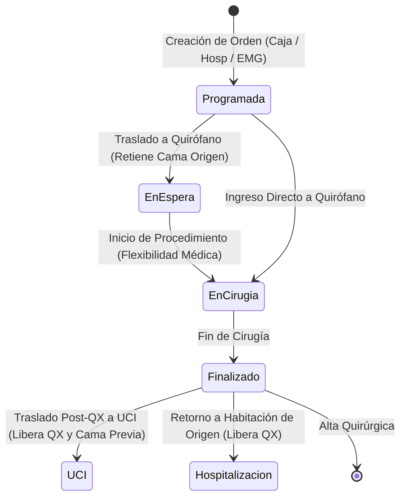

# Arquitectura del Flujo Quirúrgico, Traslados Pre/Post-Operatorios y Resiliencia de Datos (v4.0.9)

## 1. Resumen Ejecutivo
El presente documento formaliza las reglas de negocio, ciclo de vida de traslados, retención y liberación de cupos clínicos (habitaciones, camas y salas quirúrgicas), así como la normalización relacional 3FN y las estrategias de auto-reparación resiliente (*Self-Healing Schemas*) del módulo de Pabellón Quirúrgico en el **Sistema Sat Hospitalario v4.0.9**.

---

## 2. Ciclo de Vida del Paciente Quirúrgico y Retención de Ubicaciones

### Reglas de Negocio de Traslados
1. **Admisión Previa & Flexibilidad:** Un paciente admitido por Emergencia, Hospitalización o Caja puede contar con una `OrdenCirugia` sin que esto signifique ocupación inmediata de quirófano.
2. **Traslado Pre-Quirúrgico a Quirófano:**
   - La cama de origen (ej. `Habitación 101`) **permanece retenida y ocupada** (`CamaRetenidaId` en `CuentaServicios` y `AreaClinicaOrigenId` en `OrdenCirugia`) para que ningún otro ingreso tome el cupo mientras el paciente es intervenido.
   - El quirófano de destino pasa a estado `Ocupada`.
   - El estado de la cirugía transiciona a `EnEspera` o `EnCirugia`.
3. **Flexibilidad en el Ingreso a Quirófano:**
   - El personal médico y de enfermería puede ingresar al paciente a quirófano en cualquier momento.
   - Los requisitos del checklist preoperatorio son informativos y no constituyen un bloqueo excluyente para el acto quirúrgico.
4. **Traslado Post-Quirúrgico & Destinos Diferenciados:**
   - **Retorno a la misma habitación:** Se libera la sala quirúrgica (`Estado = Disponible`) y el paciente reanuda su estancia en la cama previamente retenida.
   - **Traslado a una nueva área / UCI:** Se libera la sala quirúrgica, se **libera la cama previa retenida de origen** (`camaRetenidaPrevia.Liberar()`), y se marca como ocupada la nueva cama (ej. Cama UCI 1), actualizando la `CuentaServicios` con la nueva ubicación y aplicando la tarifa de estancia correspondiente.

---

## 3. Arquitectura Técnica & Patrones de Diseño

### Backend (.NET 9 + EF Core + MediatR)
- **CQRS Handlers Resilientes:**
  - `TrasladarPacienteCirugiaCommandHandler`: Gestiona la orquestación atómica de traslados pre/post quirúrgicos, validando los estados de cama y aplicando *fallback* defensivo ante usuarios o identificadores nulos.
  - `CambiarEstadoCirugiaCommandHandler`: Implementa el patrón *State* de dominio (`ICirugiaState`) desacoplando las transiciones de estado de los bloqueos de checklist.
- **Normalización Relacional 3FN:**
  - `OrdenCirugia` cuenta con llaves foráneas explícitas `AreaClinicaOrigenId` y `SedeOrigenId`, eliminando cadenas de texto plano y garantizando integridad referencial con `AreasClinicas` y `Sedes`.
  - Mapeo explícito en `SatHospitalarioDbContext` con `DeleteBehavior.SetNull` y normalización de auditoría inmutable (`CirugiaLog`, `CirugiaObservacionHistorial`).
- **Auto-Reparación de Esquema (Self-Healing):**
  - `SystemDbInitializer.EnsureSurgicalTablesAndColumnsAsync()` verifica la presencia de todas las tablas quirúrgicas y columnas agregadas al inicializar el sistema sin requerir intervenciones manuales de migración en MySQL.

### Frontend (Angular 19+ Signals + Clean UI)
- **Caché Reactivo en Servicios:**
  - `MultiSedeService` incorpora `shareReplay({ bufferSize: 1, refCount: false })` para `getSedes()` y `getAreasClinicas()`, eliminando latencias y llamadas HTTP redundantes al abrir el modal de traslados.
- **Scrollbar Responsive & Movilidad en Drawer:**
  - Contenedor principal de pestañas con `max-h-[calc(100vh-210px)] overflow-y-auto` y checklist preoperatorio con scroll independiente `max-h-80 overflow-y-auto`.
  - Acceso garantizado y visible para checklists extensos (5+ ítems) y botones de acción rápida.
- **Carga Perezosa (Lazy-Loading):**
  - El catálogo de insumos se carga bajo demanda únicamente cuando el usuario navega a la pestaña *Insumos & Kits*, acelerando la apertura inicial del panel clínico.

---

## 4. Matriz de Validación y Cobertura de Pruebas

| Componente | Caso de Prueba | Resultado |
| :--- | :--- | :--- |
| `TrasladarPacienteCirugiaCommandHandler` | Traslado Pre-Quirúrgico a Quirófano (Retiene Cama Origen) | **Aprobado (100%)** |
| `TrasladarPacienteCirugiaCommandHandler` | Traslado Post-Quirúrgico a UCI (Libera QX y Cama Origen) | **Aprobado (100%)** |
| `TrasladarPacienteCirugiaCommandHandler` | Manejo Defensivo de Usuario Nulo/Vacío | **Aprobado (100%)** |
| `SatHospitalarioDbContext` | Normalización de Entidades de Auditoría Inmutables | **Aprobado (100%)** |
| `Suite Total` | 225 Pruebas Unitarias de Backend en xUnit | **225 / 225 Aprobadas** |
