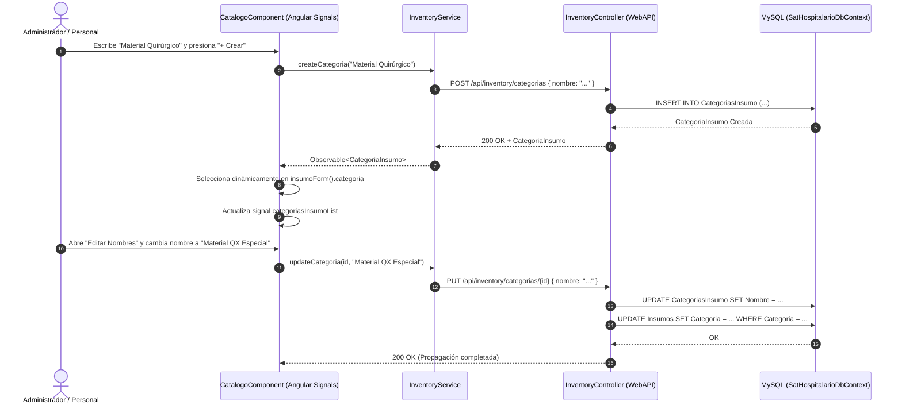

# Memoria de Arquitectura: Gestión Dinámica y Relacional de Categorías de Insumos (DB-Driven)

## Contexto y Alcance
En el módulo de Catálogo de Inventario (`/inventario/catalogo`), la clasificación de insumos y medicamentos dependía anteriormente de categorías con opciones fijas en frontend.

Con esta implementación, las **Categorías de Insumos y Medicamentos** pasan a ser entidades de primera clase en la base de datos (`CategoriaInsumo`), permitiendo su creación, consulta dinámica, modificación en caliente de nombres y sincronización relacional con los insumos existentes.

---

## Modelo de Dominio y Normalización (3FN)

### Entidad `CategoriaInsumo`
- **Tabla**: `CategoriasInsumo`
- **Estructura**:
  - `Id` (`Guid`, Primary Key)
  - `Nombre` (`string`, max 150, Unique Index `IX_CategoriasInsumo_Nombre`)
  - `Codigo` (`string?`, max 50)
  - `Activo` (`bool`, default `true`)
  - `FechaCreacion` (`DateTime`, UTC)
- **Métodos de Dominio**:
  - `ActualizarNombre(string nuevoNombre, string? codigo)`: Valida no nulidad ni cadenas vacías.
  - `SetEstado(bool activo)`: Habilita o inhabilita lógicamente la categoría.

### Sembrado Inicial y Auto-Reparación (Self-Healing)
En `SystemDbInitializer.cs`, se ejecutan instrucciones DDL que garantizan la existencia de la tabla e índices en entornos SQLite y MySQL, así como el sembrado automático si la tabla está vacía:
1. `Medicamento` (`MED`)
2. `Descartable` (`DESC`)
3. `Material Médico` (`MAT-MED`)
4. `Reactivo` (`REACT`)
5. `Material Quirúrgico` (`MAT-QX`)
6. `Otro` (`OTRO`)

---

## Endpoints RESTful (`InventoryController.cs`)

| Verbo | Ruta | Descripción |
|---|---|---|
| `GET` | `/api/inventory/categorias` | Retorna listado de categorías activas ordenadas alfabéticamente. |
| `POST` | `/api/inventory/categorias` | Registra una nueva categoría con validación case-insensitive de unicidad. |
| `PUT` | `/api/inventory/categorias/{id}` | Modifica el nombre de la categoría y propaga el cambio a todos los `Insumos` vinculados. |
| `DELETE` | `/api/inventory/categorias/{id}` | Desactiva lógicamente la categoría (`Activo = false`). |

---

## Diagrama de Flujo

