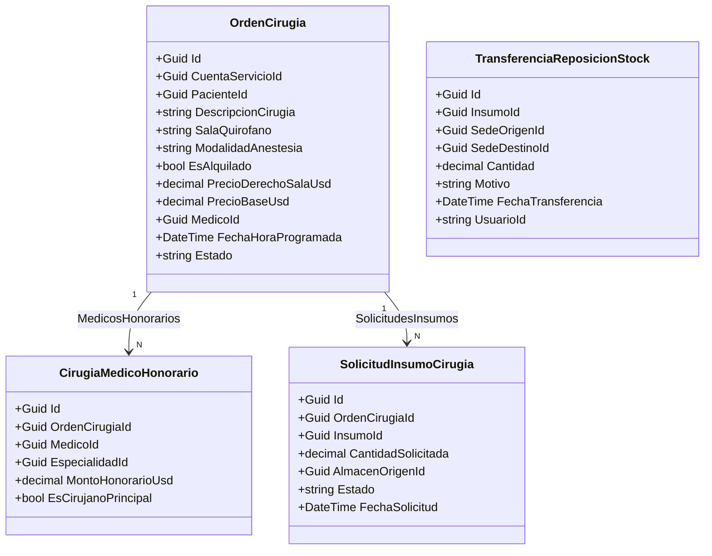

# Módulo de Cirugía, Pabellón Quirúrgico y Gestión de Reposición de Inventario (v4.0.9)

## 1. Executive Summary
El módulo de **Pabellón Quirúrgico y Gestión de Reposición de Inventario** centraliza la programación de intervenciones quirúrgicas, la asignación y consumo de insumos (Kits / BOM y solicitudes ad-hoc), el checklist preoperatorio DB-Driven y la liquidación de honorarios de $N$ médicos con derecho de sala y control de pabellón alquilado. Adicionalmente, provee al **Supervisor de Inventario** de un **Apartado de Reposición e Intercambio de Insumos** multi-sede y multi-subárea para gestionar devoluciones por talla/calibre y reposiciones sin desfase de stock.

---

## 2. Architectural Blueprint & Modelos de Dominio

### 2.1 Normalización en 3FN y Tipado Relacional Estricto
- **`CirugiaMedicoHonorario`**: Soporta hasta $N$ médicos participantes por acto quirúrgico. El rol o tipo del médico queda normalizado en 3FN mediante `EspecialidadId` (FK a `Especialidades`), eliminando cadenas de texto libres. La distinción del cirujano responsable se realiza mediante el flag de dominio booleano `EsCirujanoPrincipal`.
- **`SolicitudInsumoCirugia`**: Maneja pedidos ad-hoc intraoperatorios de urgencia desde quirófano hacia el Almacén Central/Sede Principal.
- **`TransferenciaReposicionStock`**: Registra auditoría y trazabilidad atómica de transferencias y reposiciones de stock entre sedes y sub-áreas.
- **`OrdenCirugia`**: Incorpora `SalaQuirofano`, `ModalidadAnestesia`, `EsAlquilado`, `PrecioDerechoSalaUsd`, `PrecioBaseUsd` y colecciones de navegación.

---

## 3. Flujo Operativo y Segregación de Funciones (SoD)

### 3.1 Personal de Enfermería / Quirófano
1. **Pre-ingreso y Checklist**: Verificación interactiva de requisitos prequirúrgicos (*Ayuno, Laboratorios, Evaluación Cardiovascular, etc.*).
2. **Solicitud de Insumos Ad-Hoc**: Peticiones directas de insumos no contemplados en el kit inicial al Almacén Central.
3. **Control de Flujo de Estados**: Transición de estados (*Programada* $\to$ *En Espera* $\to$ *En Cirugía* $\to$ *Finalizado* / *Cancelada*).

### 3.2 Supervisor de Inventario / Farmacia
1. **Asignación y Despacho de Kits Quirúrgicos**: Descuento atómico del stock en Sede Principal y cargo en `InsumosCirugiasPacientes`.
2. **Devolución de Sobrantes**: Reingreso automático de insumos no consumidos al stock del almacén central y deducción de la cuenta del paciente.
3. **Apartado de Reposición e Intercambio de Insumos**: Transferencias atómicas entre sedes y sub-áreas para cambios de talla o sustituciones por deterioro sin generar desfases ni discrepancias de Kárdex.

### 3.3 Administración / Facturación y Caja
1. **Equipo de $N$ Médicos y Honorarios**: Asignación de honorarios individuales en USD ($) por médico y especialidad.
2. **Derecho de Sala y Pabellón Alquilado**: Fijación del costo de sala y flag de cirujanos externos (`EsAlquilado = true`).

---

## 4. Frontend Angular 19+ (Signals, Standalone, OnPush)

1. **`pabellon-gestion.component.ts`**: Componente orquestador con pestañas de navegación:
   - **Tablero de Pacientes** (`pabellon-pacientes-lista.component.ts`)
   - **Calendario Quirúrgico Total** (`pabellon-calendario.component.ts`)
   - **Apartado de Reposición de Inventario** (`reposicion-inventario.component.ts`)
2. **`panel-detalle-cirugia.component.ts`**: Drawer lateral contextual con 4 pestañas especializadas por rol:
   - *Checklist Preop & Estado* (Enfermería)
   - *Insumos & Kits* (Supervisor de Inventario / Farmacia)
   - *Honorarios & Precios* (Administración / Caja)
   - *Auditoría & Trazabilidad* (Logs inmutables)
3. **`reposicion-inventario.component.ts`**: Vista interactiva para registrar transferencias, devoluciones por talla y reposiciones multi-sede.

---

## 5. Verificación y Calidad de Código
- **Backend .NET 9**: 99/99 pruebas unitarias aprobadas en `tests/SistemaSatHospitalario.Tests.Unit`.
- **Frontend Angular 19+**: Compilación de bundle de producción (`ng build`) completada con **0 errores**.
