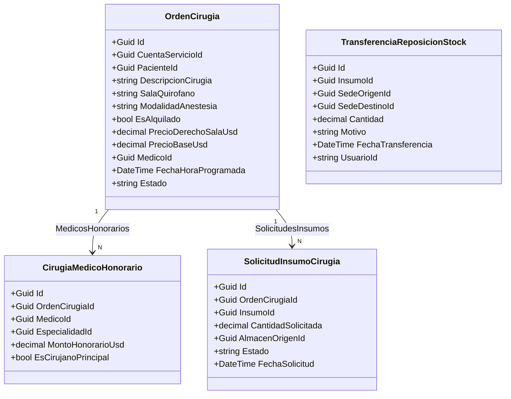

# Módulo de Cirugía, Pabellón Quirúrgico y Gestión de Reposición de Inventario (v4.0.9)

## 1. Executive Summary
El módulo de **Pabellón Quirúrgico y Gestión de Reposición de Inventario** centraliza la programación de intervenciones quirúrgicas, la asignación y consumo de insumos (Kits / BOM y solicitudes ad-hoc), el checklist preoperatorio DB-Driven y la liquidación de honorarios de $N$ médicos con derecho de sala y control de pabellón alquilado. Adicionalmente, provee al **Supervisor de Inventario** de un **Apartado de Reposición e Intercambio de Insumos** multi-sede y multi-subárea para gestionar devoluciones por talla/calibre y reposiciones sin desfase de stock.

---

## 2. Architectural Blueprint & Modelos de Dominio

### 2.1 Normalización en 3FN y Tipado Relacional Estricto
- **`CirugiaMedicoHonorario`**: Soporta hasta $N$ médicos participantes por acto quirúrgico. El rol o tipo del médico queda normalizado en 3FN mediante `EspecialidadId` (FK a `Especialidades`), eliminando cadenas de texto libres. La distinción del cirujano responsable se realiza mediante el flag de dominio booleano `EsCirujanoPrincipal`.
- **`SolicitudInsumoCirugia`**: Maneja pedidos ad-hoc intraoperatorios de urgencia desde quirófano hacia el Almacén Central/Sede Principal.
- **`TransferenciaReposicionStock`**: Registra auditoría y trazabilidad atómica de transferencias y reposiciones de stock entre sedes y sub-áreas.
- **`OrdenCirugia`**: Incorpora `SalaQuirofano`, `ModalidadAnestesia`, `EsAlquilado`, `PrecioDerechoSalaUsd`, `PrecioBaseUsd` y colecciones de navegación.

---

## 3. Flujo Operativo y Segregación de Funciones (SoD)

### 3.1 Personal de Enfermería / Quirófano
1. **Pre-ingreso y Checklist**: Verificación interactiva de requisitos prequirúrgicos (*Ayuno, Laboratorios, Evaluación Cardiovascular, etc.*).
2. **Solicitud de Insumos Ad-Hoc**: Peticiones directas de insumos no contemplados en el kit inicial al Almacén Central.
3. **Control de Flujo de Estados**: Transición de estados (*Programada* $\to$ *En Espera* $\to$ *En Cirugía* $\to$ *Finalizado* / *Cancelada*).

### 3.2 Supervisor de Inventario / Farmacia
1. **Asignación y Despacho de Kits Quirúrgicos**: Descuento atómico del stock en Sede Principal y cargo en `InsumosCirugiasPacientes`.
2. **Devolución de Sobrantes**: Reingreso automático de insumos no consumidos al stock del almacén central y deducción de la cuenta del paciente.
3. **Apartado de Reposición e Intercambio de Insumos**: Transferencias atómicas entre sedes y sub-áreas para cambios de talla o sustituciones por deterioro sin generar desfases ni discrepancias de Kárdex.

### 3.3 Administración / Facturación y Caja
1. **Equipo de $N$ Médicos y Honorarios**: Asignación de honorarios individuales en USD ($) por médico y especialidad.
2. **Derecho de Sala y Pabellón Alquilado**: Fijación del costo de sala y flag de cirujanos externos (`EsAlquilado = true`).

---

## 4. Frontend Angular 19+ (Signals, Standalone, OnPush)

1. **`pabellon-gestion.component.ts`**: Componente orquestador con pestañas de navegación:
   - **Tablero de Pacientes** (`pabellon-pacientes-lista.component.ts`)
   - **Calendario Quirúrgico Total** (`pabellon-calendario.component.ts`)
   - **Apartado de Reposición de Inventario** (`reposicion-inventario.component.ts`)
2. **`panel-detalle-cirugia.component.ts`**: Drawer lateral contextual con 5 pestañas especializadas por rol:
   - *Checklist Preop & Estado* (Enfermería, con mutación optimista instantánea a 0ms de latencia)
   - *Insumos & Kits* (Supervisor de Inventario / Farmacia)
   - *Honorarios & Precios* (Administración / Caja)
   - *Reasignar Fecha/Hora* (Reprogramación con justificación médica obligatoria e historial auditado)
   - *Auditoría & Trazabilidad* (Logs inmutables)
3. **`reposicion-inventario.component.ts`**: Vista interactiva para registrar transferencias, devoluciones por talla y reposiciones multi-sede.
4. **`historiales.component.html`**: Tablas de trazabilidad con anchos mínimos configurados (`min-w-[220px]`, `min-w-[280px]`), padding horizontal generoso (`px-5 py-3.5`) y separación tipográfica de columnas para evitar solapamientos entre fechas, insumos y cantidades.

---

## 6. Segregación Estricta de Quirófanos y Administración en Habitaciones
- **Segregación Estricta**: En el módulo de Pabellón Quirúrgico (`/pabellon`) y su Calendario Total se listan **únicamente los Quirófanos** asignados a la sede de Cirugía (`SedeId_Cirugia`), aislando completamente las habitaciones y camas de hospitalización.
- **Anexado de Quirófanos**: En el módulo de **Habitaciones** (`/admision/hospitalizacion`) se implementó la pestaña **Quirófanos**, permitiendo visualizar las salas quirúrgicas operativas y anexar nuevos quirófanos (`+ Anexar Quirófano`) asignados directamente a la Sede de Cirugía.
- **Gestión de Sedes y Áreas**: El componente `SedeManagementComponent` (`/inventario/sedes-areas`) permite gestionar y anexar sub-áreas y quirófanos en cualquier sede del hospital.

---

## 7. Resiliencia Operativa, Concurrencia y Retorno de Stock
- **Devolución Atómica de Insumos Quirúrgicos (`ProcesarDevolucionInsumoCommand`)**: Cuando se registran devoluciones de sobrantes de quirófano, se acredita automáticamente el stock a `StocksSedes` (creando la entidad si no existía), se genera el registro inmutable en `MovimientosInsumo` (Kárdex) y se reconcilian los ítems devueltos en las vistas consolidadas.
- **Transición de Estados Quirúrgicos sin Fricción (`CambiarEstadoCirugiaCommand`)**: Eager loading de `HistorialObservaciones` y `Logs` para garantizar transiciones atómicas directas (`Programada` $\to$ `EnCirugia` / `EnEspera`) con feedback visual instantáneo.
- **Traslado Concurrente de Pacientes (`TrasladarPacienteCirugiaCommand`)**: Actualización atómica de camas y ubicaciones vinculadas a la cuenta abierta activa, liberando camas previas y evitando excepciones de concurrencia optimista (`DbUpdateConcurrencyException`).
- **Reasignación de Fecha y Hora (`ReprogramarCirugiaCommand`)**: Comando específico que valida el estado de la orden, actualiza la fecha/hora y registra inmutablemente el motivo en auditoría e historial clínico.
- **Ítem de Cobro Automático por Ingreso y Traslados Multi-Área (`AbrirCuentaClinicaCommand`, `TrasladarPacienteCommand`, `RegistrarTrasladoAreaCommand`)**:
  - Al admitir un paciente en Emergencia, Hospitalización o UCI, se registra automáticamente el ítem de cargo en `DetallesServicioCuenta`. En **Emergencia** el precio base se establece en `$0.00 USD` para cuadre administrativo mientras la enfermera atiende al paciente; en **Hospitalización** y **UCI** se aplica la tarifa base de la cama configurada en el catálogo (`ServicioTarifaBase?.PrecioBase`).
  - Todo traslado físico entre áreas genera un ítem de cargo para cobro en la cuenta resultante, garantizando trazabilidad cronológica y financiera total.
  - La **Fecha de Ingreso** (`FechaCarga`) se visualiza prominentemente en las tarjetas de pacientes activos y en la cabecera del espacio de trabajo clínico.
- **Carga Unificada de Servicios e Insumos en Cierre de Cuenta y Enfermería**:
  - Reutilización estricta de componentes modulares (`DynamicStepperComponent`, `StepCatalogSearchComponent`, `StepDoctorSelectComponent`, `StepLabRxPriceComponent`, `StepQuantityComponent`, `StepConfirmComponent`, `NursingCartComponent`) en `/cierre-cuenta` y `/enfermeria`.
  - Habilitación del panel de carga de insumos en toda cuenta abierta (`selectedAccount()?.estado !== 'Facturada'`), reactividad con `fastChargeQuantity = signal<number>(1)`, preselección automática de áreas clínicas y liquidación masiva atómica vía `/api/Billing/CargarServiciosMasivo`.
- **Jerarquía Visual y Stacking Context**: Header global ajustado a `z-10` y área de contenido principal a `z-20` para evitar que elementos superiores tapen los drawers y modales (`z-[500]`).

---

## 8. Verificación y Calidad de Código
- **Backend .NET 10 / C#**: 107/107 pruebas unitarias aprobadas en `tests/SistemaSatHospitalario.Tests.Unit` (100% de éxito).
- **Frontend Angular 19+**: Compilación de bundle de producción (`ng build`) completada con **0 errores**, formulario de compras limpio conforme a reglas de diseño DB-Driven sin campos no persistidos.

