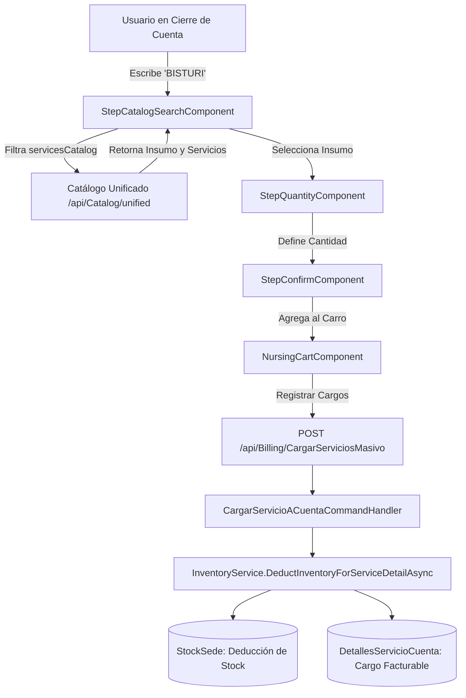

# Memoria de Arquitectura: Unificación de Insumos en Catálogo Clínico y Deducción Directa en Cierre de Cuentas

## Contexto y Alcance
En los módulos clínicos y administrativos de **Cierre de Cuentas** (`/cierre-cuenta/Hospitalizacion` y `/cierre-cuenta/Emergencia`) y **Enfermería** (`/enfermeria`), el personal de salud y asistentes de facturación cargan insumos, medicamentos, consultas médicas y exámenes clínicos a las cuentas de los pacientes (`CuentaServicios`).

Anteriormente, el endpoint `/api/Catalog/unified` únicamente proyectaba `ServiciosClinicos` activos y perfiles de laboratorio legados, provocando que los insumos y medicamentos registrados en el inventario/kárdex (`Insumos` y `StocksSedes`) no aparecieran en los buscadores de carga rápida.

## Decisiones de Arquitectura

### 1. Proyección Dinámica de Insumos en `GetUnifiedCatalogQueryHandler`
- La consulta unificada combina en tiempo real:
  1. `ServiciosClinicos` activos (`Where(s => s.Activo)`).
  2. `Insumos` activos (`Where(i => !i.IsDeleted)`) que no posean duplicados en códigos preexistentes.
  3. `PerfilLegacy` de laboratorio proveniente de la capa de interoperabilidad.
- Cada insumo se mapea como un `CatalogItemDto` con:
  - `TipoServicioId = 5` (`TipoServicioConstants.Insumo`).
  - `EditorType = "MEDICAMENTO"`.
  - `CategoryId = 4` (`ServiceCategory.Insumo`).
  - `PrecioUsd = CostoUnitarioBaseUSD` y `PrecioBs = PrecioUsd * TasaCambio`.
  - `Receta = [ 1 unidad del InsumoId ]` (auto-receta para deducción).

### 2. Deducción Universal y Resiliente en `InventoryService`
- En `DeductInventoryForServiceDetailAsync`, el motor de deducción evalúa:
  1. Si existen recetas en `ServiciosInsumoRecetas` vinculadas al `ServicioClinicoId` o `ServicioCodigo`.
  2. Si no existen recetas compuestas, busca el insumo directo en `_context.Insumos` por `Id` o `Codigo`.
  3. Ejecuta la deducción sobre `StocksSedes` en la sede correspondiente (`Hospitalizacion` = `SeedConstants.SedeId_Hospitalizacion`, `Emergencia` = `SeedConstants.SedeId_Emergencia`, etc.).
  4. Registra los movimientos de auditoría en `ConsumosServiciosRealizados` y `MovimientosInsumo`.

### 3. Normalización del Motor de Clasificación en Frontend (`classifyService`)
- En `enfermeria.component.ts` y compartido con `cierre-cuenta.component.ts`:
  - `tipoServicioId === 5` o `tipo` con `MEDICAM`, `INSUMO`, `FARMACIA`, `MATERIAL` retorna estrictamente `ITEM_CLASSIFICATIONS.MEDICAMENTO`.
  - Activa el stepper en modo `medicamento` (`app-step-quantity`), permitiendo seleccionar cantidad, visualizar precio unitario y total estimado, y confirmar la carga en el carro de facturación.

