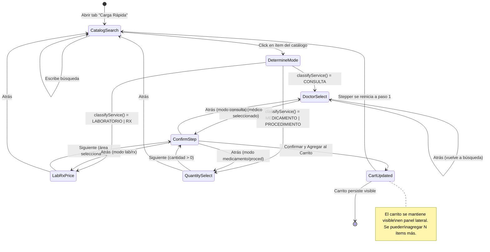

# Planificación UI: Asistente de Enfermería — Stepper Dinámico Inteligente

> **Fecha:** 2026-07-02  
> **Módulo:** Enfermería (Sistema Sat Hospitalario)  
> **Stack:** Angular 19 + TailwindCSS Glassmorphism + Lucide Icons  
> **Estado actual:** El componente `enfermeria.component.ts` ya tiene triage, fast-charge con stepper básico de 3 pasos fijos, y transfer.  
> **Objetivo:** Reemplazar el stepper fijo por uno **dinámico** que adapte sus pasos según el tipo de ítem seleccionado, con acumulación de carrito multi-ítem y sin paso de pago.

---

## 1. Concepto General del Flujo

```
┌─────────────────────────────────────────────────────────────────┐
│                  ASISTENTE DE ENFERMERÍA                        │
│                                                                 │
│  [Paciente] → [Catálogo] → { Stepper Dinámico } → [Carrito] → [Registrar] │
│                                                                 │
│  El stepper CAMBIA sus pasos según classifyService(item):       │
│                                                                 │
│  • CONSULTA:     Búsqueda → Médico+Honorarios → Confirmar       │
│  • LAB/RX:       Búsqueda → Precio/Ajustes → Confirmar          │
│  • MEDICAMENTO:  Búsqueda → Cantidad → Confirmar                │
│  • PROCEDIMIENTO:Búsqueda → Cantidad+Área → Confirmar           │
└─────────────────────────────────────────────────────────────────┘
```

**Reglas de negocio para Emergencia:**
- No hay horario de cita (se omite `horaCita`, se usa `new Date().toISOString()`)
- No hay paso de pago — el cargo se registra directo a crédito del paciente
- Se pueden agregar **N ítems** al carrito (consulta + perfiles + medicamentos)
- El stepper se reinicia para cada ítem nuevo, pero el carrito persiste

---

## 2. Arquitectura de Señales (State Management)

### 2.1 Nuevas señales necesarias

```typescript
// ──── Stepper Dinámico ────
/** Paso actual dentro del wizard de carga (1, 2, 3) */
currentStep = signal<number>(1);

/** Tipo de stepper activo según la clasificación del ítem seleccionado */
activeStepperMode = signal<StepperMode>('catalog'); 
// 'catalog' | 'consulta' | 'lab-rx' | 'medicamento' | 'procedimiento'

type StepperMode = 'catalog' | 'consulta' | 'lab-rx' | 'medicamento' | 'procedimiento';

// ──── Carrito Multi-ítem (Acumulación) ────
/** Ítems ya confirmados en el carrito local (pendientes de registrar) */
cartItems = signal<CartItem[]>([]);

interface CartItem {
  id: string;                    // UUID temporal local
  servicioId: string;
  descripcion: string;
  classification: ItemClassification;
  precioBase: number;
  honorario: number;
  cantidad: number;
  medicoId: string | null;
  medicoNombre: string | null;
  areaClinicaId: string | null;
  areaClinicaNombre: string | null;
  unidadMedida: string;
}

// ──── Totales del Carrito (Computed) ────
cartTotalUSD = computed(() => 
  this.cartItems().reduce((acc, item) => acc + (item.precioBase + item.honorario) * item.cantidad, 0)
);

cartItemCount = computed(() => this.cartItems().length);

// ──── Selección Actual (para el stepper) ────
/** Ítem del catálogo actualmente en configuración */
selectedCatalogItem = signal<ServicioCatalogo | null>(null);
/** Clasificación del ítem actual (computed del selectedCatalogItem) */
currentClassification = computed(() => classifyService(this.selectedCatalogItem()));
```

### 2.2 Señales existentes que se REUTILIZAN

| Señal | Uso actual | Cambio |
|-------|-----------|--------|
| `selectedService` | Ítem único en stepper | Se reemplaza por `selectedCatalogItem` |
| `selectedMedicoId` | Médico del ítem actual | Se mantiene, se resetea por ítem |
| `selectedAreaClinicaId` | Área clínica | Se mantiene, auto-preselecciona |
| `customPrecio` | Precio manual | Se mantiene |
| `customHonorario` | Honorario manual | Se mantiene |
| `fastChargeQuantity` | Cantidad | Se mantiene |
| `fastChargeSearchTerm` | Búsqueda | Se mantiene |
| `filteredServices` | Resultados filtrados | Se mantiene |
| `itemClassification` | Clasificación computed | Se reemplaza por `currentClassification` |
| `precioFinalCalculado` | Precio computed | Se mantiene lógica, ajustada al nuevo contexto |

---

## 3. Definición de Modos del Stepper

Cada modo define **qué pasos** muestra y **qué validaciones** requiere:

### Modo 1: `catalog` (Búsqueda inicial — paso común)

```
┌─────────────┐
│  STEP 1/1   │
│  Búsqueda   │  ← Input de búsqueda + resultados autocomplete
│  Catálogo   │  ← Al seleccionar, se determina el modo y se transiciona
└─────────────┘
```

**Siempre es el primer paso.** Al hacer click en un resultado, se ejecuta `classifyService()` y se determina el modo:

```
CONSULTA      → stepperMode = 'consulta', avanzar a step 2 (Médico)
LAB/RX        → stepperMode = 'lab-rx', avanzar a step 2 (Ajustes)
MEDICAMENTO   → stepperMode = 'medicamento', avanzar a step 2 (Cantidad)
PROCEDIMIENTO → stepperMode = 'procedimiento', avanzar a step 2 (Cantidad+Área)
```

### Modo 2: `consulta` (3 pasos)

```
┌──────────────┐     ┌──────────────────┐     ┌──────────────┐
│  STEP 1/3    │ ──► │  STEP 2/3        │ ──► │  STEP 3/3    │
│  Búsqueda    │     │  Médico +        │     │  Confirmar   │
│  (catálogo)  │     │  Honorarios      │     │  y Agregar   │
└──────────────┘     └──────────────────┘     └──────────────┘
```

**Step 2 — Médico + Honorarios:**
- Selector de médico (requerido, con filtro por especialidad inferida del nombre de consulta)
- Precio base consulta (editable)
- Honorario médico (editable, auto-cargado del médico seleccionado)
- Área clínica (auto-preseleccionada del tipoIngreso del paciente)
- Badge de total estimado

**Validación Step 2 → 3:** `selectedMedicoId !== null && selectedAreaClinicaId !== null`

### Modo 3: `lab-rx` (3 pasos)

```
┌──────────────┐     ┌──────────────────┐     ┌──────────────┐
│  STEP 1/3    │ ──► │  STEP 2/3        │ ──► │  STEP 3/3    │
│  Búsqueda    │     │  Precio +        │     │  Confirmar   │
│  (catálogo)  │     │  Médico (opc.)   │     │  y Agregar   │
└──────────────┘     └──────────────────┘     └──────────────┘
```

**Step 2 — Precio + Médico opcional:**
- Precio del estudio/perfil (editable, pre-cargado del catálogo)
- Médico responsable (OPCIONAL — solo si el ítem tiene `honorarioBase > 0`)
- Cantidad = 1 (fijo, no editable para LAB/RX)
- Área clínica (auto-preseleccionada)
- Badge de total estimado

**Validación Step 2 → 3:** `selectedAreaClinicaId !== null` (médico no requerido)

### Modo 4: `medicamento` (3 pasos)

```
┌──────────────┐     ┌──────────────────┐     ┌──────────────┐
│  STEP 1/3    │ ──► │  STEP 2/3        │ ──► │  STEP 3/3    │
│  Búsqueda    │     │  Cantidad        │     │  Confirmar   │
│  (catálogo)  │     │  + Área          │     │  y Agregar   │
└──────────────┘     └──────────────────┘     └──────────────┘
```

**Step 2 — Cantidad:**
- Input gigante de cantidad con botones +/- (igual al actual)
- Soporta `permiteFraccionamiento` (step 0.01 vs 1)
- Área clínica (auto-preseleccionada)
- Badge de total estimado = precioBase × cantidad

**Validación Step 2 → 3:** `fastChargeQuantity > 0 && selectedAreaClinicaId !== null`

### Modo 5: `procedimiento` (3 pasos)

```
┌──────────────┐     ┌──────────────────┐     ┌──────────────┐
│  STEP 1/3    │     │  STEP 2/3        │     │  STEP 3/3    │
│  Búsqueda    │     │  Cantidad        │     │  Confirmar   │
│  (catálogo)  │     │  + Área          │     │  y Agregar   │
└──────────────┘     └──────────────────┘     └──────────────┘
```

Igual que medicamento pero puede requerir médico si `honorarioBase > 0`.

---

## 4. Componentes Nuevos a Crear

```
enfermeria/
├── enfermeria.component.ts          (MODIFICADO — nueva lógica de stepper dinámico + carrito)
├── enfermeria.component.html        (MODIFICADO — nuevo template con carrito lateral)
├── components/
│   ├── dynamic-stepper/
│   │   ├── dynamic-stepper.component.ts    (NUEVO — stepper que cambia pasos según modo)
│   │   └── dynamic-stepper.component.html  (NUEVO — template del stepper)
│   ├── nursing-cart/
│   │   ├── nursing-cart.component.ts       (NUEVO — carrito lateral de ítems acumulados)
│   │   └── nursing-cart.component.html     (NUEVO — template del carrito)
│   └── step-panels/
│       ├── step-catalog-search.component.ts    (NUEVO — paso 1 común: búsqueda)
│       ├── step-doctor-select.component.ts     (NUEVO — paso 2 consulta: médico+honorarios)
│       ├── step-lab-rx-price.component.ts      (NUEVO — paso 2 lab/rx: precio)
│       ├── step-quantity.component.ts          (NUEVO — paso 2 medicamento/proced: cantidad)
│       └── step-confirm.component.ts           (NUEVO — paso 3 común: confirmación)
```

### 4.1 `DynamicStepperComponent`

**Responsabilidad:** Renderizar el header del stepper con círculos y labels dinámicos según el modo.

**Inputs:**
```typescript
@Input() currentStep: number;           // 1, 2, 3
@Input() stepperMode: StepperMode;      // 'consulta' | 'lab-rx' | 'medicamento' | 'procedimiento'
@Input() stepLabels: string[];          // ['Búsqueda', 'Médico', 'Confirmar'] etc.
```

**Comportamiento:**
- Los círculos se colorean según `currentStep`
- Los labels cambian según `stepperMode`
- Las líneas conectoras se colorean según progreso
- No contiene lógica de navegación — solo renderizado

### 4.2 `NursingCartComponent`

**Responsabilidad:** Mostrar el carrito lateral con ítems acumulados, totales, y botón de registrar todo.

**Inputs:**
```typescript
@Input() cartItems: CartItem[];
@Input() cartTotalUSD: number;
@Input() isSaving: boolean;
@Input() selectedPatientName: string | null;
```

**Outputs:**
```typescript
@Output() removeItem = new EventEmitter<string>();    // cartItem.id
@Output() editItem = new EventEmitter<string>();      // cartItem.id (reabre en stepper)
@Output() registerAll = new EventEmitter<void>();     // dispara submitMasivo()
```

**UI:**
- Panel glass-panel a la derecha del workspace
- Lista de ítems con: icono según clasificación, descripción, cantidad, precio, médico (si aplica)
- Botón X para quitar, botón lápiz para editar (recarga en stepper)
- Total acumulado en USD grande abajo
- Botón "REGISTRAR TODO A LA CUENTA" con loading state
- Badge de conteo: "3 ítems en carrito"

### 4.3 Step Panels (Componentes pequeños)

Cada step panel es un componente tonto que recibe inputs y emite outputs. Esto mantiene `enfermeria.component.ts` como orquestador limpio.

#### `StepCatalogSearchComponent`
```typescript
@Input() searchTerm: string;
@Input() filteredServices: ServicioCatalogo[];
@Input() selectedItem: ServicioCatalogo | null;
@Output() searchChange = new EventEmitter<string>();
@Output() itemSelected = new EventEmitter<ServicioCatalogo>();
```

#### `StepDoctorSelectComponent`
```typescript
@Input() medicos: Medico[];
@Input() selectedMedicoId: string | null;
@Input() customPrecio: number | null;
@Input() customHonorario: number | null;
@Input() selectedAreaClinicaId: string | null;
@Input() areasClinicas: AreaClinica[];
@Input() precioFinalCalculado: number;
@Input() classification: ItemClassification;
@Output() medicoSelected = new EventEmitter<string | null>();
@Output() precioChange = new EventEmitter<number>();
@Output() honorarioChange = new EventEmitter<number>();
@Output() areaChange = new EventEmitter<string | null>();
```

#### `StepLabRxPriceComponent`
```typescript
@Input() customPrecio: number | null;
@Input() selectedMedicoId: string | null;      // opcional
@Input() medicos: Medico[];
@Input() selectedAreaClinicaId: string | null;
@Input() areasClinicas: AreaClinica[];
@Input() precioFinalCalculado: number;
@Input() hasHonorario: boolean;                // si honorarioBase > 0
@Output() precioChange = new EventEmitter<number>();
@Output() medicoSelected = new EventEmitter<string | null>();
@Output() areaChange = new EventEmitter<string | null>();
```

#### `StepQuantityComponent`
```typescript
@Input() quantity: number;
@Input() unitLabel: string;
@Input() permiteFraccionamiento: boolean;
@Input() selectedAreaClinicaId: string | null;
@Input() areasClinicas: AreaClinica[];
@Input() precioFinalCalculado: number;
@Input() classification: ItemClassification;
@Output() quantityChange = new EventEmitter<number>();
@Output() areaChange = new EventEmitter<string | null>();
```

#### `StepConfirmComponent`
```typescript
@Input() cartItem: CartItem;                   // ítem a confirmar (preview)
@Input() patientName: string;
@Input() patientCedula: string;
@Input() isSaving: boolean;
@Output() confirm = new EventEmitter<void>();  // agrega al carrito
@Output() back = new EventEmitter<void>();
```

---

## 5. Flujo de Navegación del Stepper



---

## 6. Métodos Clave en `enfermeria.component.ts`

### 6.1 `onCatalogItemSelected(item: ServicioCatalogo)`

```typescript
public onCatalogItemSelected(item: ServicioCatalogo): void {
  this.selectedCatalogItem.set(item);
  this.fastChargeSearchTerm.set(item.descripcion);
  this.filteredServices.set([]);
  
  // Resetear estado del ítem actual
  this.fastChargeQuantity = 1;
  this.selectedMedicoId.set(null);
  this.customPrecio.set(item.precioUsd ?? 0);
  this.customHonorario.set(item.honorarioBase ?? 0);
  
  // Auto-preseleccionar área clínica
  if (this.selectedAccount()) {
    this.autoSelectAreaClinicaForAccount(this.selectedAccount());
  }
  
  // Determinar modo del stepper
  const classification = classifyService(item);
  this.activeStepperMode.set(this.mapClassificationToMode(classification));
  
  // Avanzar al paso 2
  this.currentStep.set(2);
}

private mapClassificationToMode(c: ItemClassification): StepperMode {
  switch (c) {
    case 'Consulta': return 'consulta';
    case 'Laboratorio':
    case 'RX': return 'lab-rx';
    case 'Medicamento': return 'medicamento';
    case 'Procedimiento': return 'procedimiento';
    default: return 'medicamento';
  }
}
```

### 6.2 `addCurrentItemToCart()`

```typescript
public addCurrentItemToCart(): void {
  const item = this.selectedCatalogItem();
  if (!item) return;
  
  const classification = this.currentClassification();
  const isFixedQty = classification === 'Consulta' || 
                     classification === 'Laboratorio' || 
                     classification === 'RX';
  
  const cartItem: CartItem = {
    id: crypto.randomUUID(),  // UUID temporal
    servicioId: String(item.id),
    descripcion: item.descripcion,
    classification: classification,
    precioBase: this.customPrecio() ?? item.precioUsd ?? 0,
    honorario: this.customHonorario() ?? 0,
    cantidad: isFixedQty ? 1 : this.fastChargeQuantity,
    medicoId: this.selectedMedicoId(),
    medicoNombre: this.getMedicoNombre(this.selectedMedicoId()),
    areaClinicaId: this.selectedAreaClinicaId(),
    areaClinicaNombre: this.getAreaClinicaNombre(this.selectedAreaClinicaId()),
    unidadMedida: item.unidadMedida || 'UD'
  };
  
  this.cartItems.update(prev => [...prev, cartItem]);
  
  // Resetear para próximo ítem
  this.resetCurrentItemSelection();
  this.currentStep.set(1);
  this.activeStepperMode.set('catalog');
}
```

### 6.3 `submitAllCartItems()` (Registro Masivo)

```typescript
public submitAllCartItems(): void {
  const active = this.selectedAccount();
  const items = this.cartItems();
  if (!active || items.length === 0) return;
  
  this.isSavingFastCharge.set(true);
  
  const payload = {
    pacienteId: active.pacienteId,
    tipoIngreso: active.tipoIngreso,
    convenioId: active.convenioId,
    items: items.map(item => ({
      servicioId: item.servicioId,
      descripcion: item.descripcion,
      precio: item.precioBase,
      honorario: item.honorario,
      cantidad: item.cantidad,
      tipoServicio: item.classification === 'Consulta' ? 'Medico' : item.classification,
      medicoId: item.medicoId,
      horaCita: item.medicoId ? new Date().toISOString() : undefined,
      areaClinicaId: item.areaClinicaId,
      usuarioCarga: ''
    }))
  };
  
  this.http.post(`${environment.apiUrl}/api/Billing/CargarServiciosMasivo`, payload)
    .subscribe({
      next: () => {
        this.showSuccess(`${items.length} servicio(s) cargado(s) a la cuenta del paciente.`);
        this.cartItems.set([]);
        this.resetCurrentItemSelection();
        this.currentStep.set(1);
        this.isSavingFastCharge.set(false);
        this.refreshAccounts();
      },
      error: (err) => {
        alert('Error al cargar servicios: ' + (err.error?.Error || err.message));
        this.isSavingFastCharge.set(false);
      }
    });
}
```

### 6.4 `removeCartItem(itemId: string)`

```typescript
public removeCartItem(itemId: string): void {
  this.cartItems.update(prev => prev.filter(i => i.id !== itemId));
}
```

### 6.5 `editCartItem(itemId: string)`

```typescript
public editCartItem(itemId: string): void {
  const item = this.cartItems().find(i => i.id === itemId);
  if (!item) return;
  
  // Quitar del carrito
  this.removeCartItem(itemId);
  
  // Recargar en el stepper para edición
  const catalogItem = this.servicesCatalog().find(s => String(s.id) === item.servicioId);
  if (catalogItem) {
    this.selectedCatalogItem.set(catalogItem);
    this.fastChargeSearchTerm.set(catalogItem.descripcion);
    this.fastChargeQuantity = item.cantidad;
    this.selectedMedicoId.set(item.medicoId);
    this.customPrecio.set(item.precioBase);
    this.customHonorario.set(item.honorario);
    this.selectedAreaClinicaId.set(item.areaClinicaId);
    this.activeStepperMode.set(this.mapClassificationToMode(item.classification));
    this.currentStep.set(2); // Ir directo a ajustes
  }
}
```

---

## 7. Layout del Template

```
┌──────────────────────────────────────────────────────────────────────┐
│  TAB: TRIAGE │ TAB: CARGA RÁPIDA* │ TAB: TRASLADO                    │
├──────────────────────────────────────────────────────────────────────┤
│                                                                      │
│  ┌─────────────────────────────────┐  ┌──────────────────────────┐  │
│  │  STEMMER HEADER (dinámico)      │  │  CARRO DE ENFERMERÍA     │  │
│  │  ○ ── ○ ── ○                   │  │                          │  │
│  │  Búsqueda  Médico  Confirmar    │  │  📋 3 ítems             │  │
│  │  (labels cambian según modo)    │  │  ┌──────────────────┐   │  │
│  ├─────────────────────────────────┤  │  │ 💊 Paracetamol   │   │  │
│  │                                 │  │  │   2 unid  $5.00  │   │  │
│  │  STEP PANEL (dinámico)          │  │  │   ✕  ✎          │   │  │
│  │  *ngIf="currentStep() === X"    │  │  ├──────────────────┤   │  │
│  │  + *ngIf="stepperMode === Y"    │  │  │ 🩺 Consulta Gine │   │  │
│  │                                 │  │  │   Dr. Pérez $40  │   │  │
│  │  [Contenido del paso actual]    │  │  │   ✕  ✎          │   │  │
│  │                                 │  │  ├──────────────────┤   │  │
│  │                                 │  │  │ 🧪 Perfil Tiro  │   │  │
│  │  [Atrás] [Paso X de Y] [Sig]   │  │  │   1 unid $25.00  │   │  │
│  │                                 │  │  │   ✕  ✎          │   │  │
│  └─────────────────────────────────┘  │  └──────────────────┘   │  │
│                                       │                          │  │
│                                       │  Total: $70.00 USD      │  │
│                                       │  [REGISTRAR TODO]       │  │
│                                       └──────────────────────────┘  │
│                                                                      │
└──────────────────────────────────────────────────────────────────────┘
```

**Distribución:**
- Panel izquierdo (70% width): Stepper dinámico
- Panel derecho (30% width): Carrito lateral sticky, siempre visible mientras haya ítems

---

## 8. Plan de Implementación (Orden)

### Fase 1: Modelos y Señales (enfermeria.component.ts)
1. Agregar interfaces `CartItem`, `StepperMode`
2. Agregar signals: `cartItems`, `activeStepperMode`, `selectedCatalogItem`, `currentClassification`
3. Agregar computeds: `cartTotalUSD`, `cartItemCount`
4. Agregar métodos: `mapClassificationToMode`, `resetCurrentItemSelection`

### Fase 2: Componentes Step Panel
5. Crear `StepCatalogSearchComponent` (extraer del HTML actual el paso 1)
6. Crear `StepDoctorSelectComponent` (extraer del HTML actual el case CONSULTA del paso 2)
7. Crear `StepLabRxPriceComponent` (extraer case LAB/RX del paso 2)
8. Crear `StepQuantityComponent` (extraer case MEDICAMENTO/PROCED del paso 2)
9. Crear `StepConfirmComponent` (extraer paso 3)

### Fase 3: Carrito
10. Crear `NursingCartComponent` con template glassmorphism
11. Integrar en `enfermeria.component.html` como panel lateral derecho

### Fase 4: Stepper Header Dinámico
12. Crear `DynamicStepperComponent` 
13. Reemplazar el header estático actual por `<app-dynamic-stepper>`

### Fase 5: Integración y Orquestación
14. Refactorizar `enfermeria.component.html` — nuevo layout con carrito lateral
15. Refactorizar `enfermeria.component.ts` — métodos `addCurrentItemToCart`, `submitAllCartItems`, `removeCartItem`, `editCartItem`
16. Conectar outputs de step panels con métodos del orquestador

### Fase 6: Backend (DESPUÉS de UI)
17. Crear endpoint `POST /api/Billing/CargarServiciosMasivo` que reciba array de ítems
18. Validar que cada ítem tenga los campos requeridos según clasificación
19. Registrar todos en una transacción

---

## 9. Validaciones por Modo

| Modo | Step 2 Requerido | Step 2 Opcional | Step 2→3 Validación |
|------|-----------------|-----------------|---------------------|
| `consulta` | Médico, Área Clínica | — | `medicoId !== null && areaClinicaId !== null` |
| `lab-rx` | Área Clínica | Médico (si honorarioBase>0) | `areaClinicaId !== null` |
| `medicamento` | Cantidad > 0, Área Clínica | — | `quantity > 0 && areaClinicaId !== null` |
| `procedimiento` | Cantidad > 0, Área Clínica | Médico (si honorarioBase>0) | `quantity > 0 && areaClinicaId !== null` |

---

## 10. Notas de Diseño (Design Guidelines)

- **Glassmorphism:** `glass-panel`, `bg-white/5`, `border-white/5`, `backdrop-blur`
- **Tipografía:** Inter/Outfit, `font-black`, `uppercase tracking-widest` para labels, `font-mono` para números/precios
- **Colores:** Sin colores puros — `rose-500`, `emerald-500`, `slate-400/500`, fondos `#0b1120`/`#152035`
- **Iconos:** Solo Lucide (Check, Search, Edit, Plus, Minus, Trash2, Stethoscope, Package, Beaker, Pill, Syringe)
- **Micro-animaciones:** `transition-all duration-200`, `active:scale-95`, `animate-fade-in`
- **Estados:** Loading con `animate-spin` en RefreshCcw, disabled con `opacity-30/50`

---

## 11. Diferencias Clave con el Billing Module Estándar

| Aspecto | Billing (Facturación) | Enfermería (Nuevo) |
|---------|----------------------|---------------------|
| Horario cita | Requerido, con selector de slot | **Omitido** — `new Date().toISOString()` |
| Paso de pago | Sí, PaymentModuleComponent | **No existe** — cargo directo a crédito |
| Carrito | Local + Backend (mixto) | **Solo local** hasta registro masivo |
| Edición de precio | Inline en carrito | **En stepper** (reeditar ítem) |
| Clasificación | `isConsultationItem()` | **`classifyService()` puro** |
| Múltiples ítems | Uno por uno con pago | **Acumulación N ítems → registro masivo** |
| Endpoint | `CargarServicio` (individual) | **`CargarServiciosMasivo`** (nuevo) |

---

## 12. Resumen de Archivos a Modificar/Crear

| Archivo | Acción |
|---------|--------|
| `enfermeria.component.ts` | **MODIFICAR** — nuevas signals, métodos de carrito, orquestación |
| `enfermeria.component.html` | **MODIFICAR** — layout con carrito lateral, stepper dinámico |
| `components/dynamic-stepper/` | **CREAR** — 2 archivos (.ts, .html) |
| `components/nursing-cart/` | **CREAR** — 2 archivos (.ts, .html) |
| `components/step-panels/step-catalog-search/` | **CREAR** — 2 archivos |
| `components/step-panels/step-doctor-select/` | **CREAR** — 2 archivos |
| `components/step-panels/step-lab-rx-price/` | **CREAR** — 2 archivos |
| `components/step-panels/step-quantity/` | **CREAR** — 2 archivos |
| `components/step-panels/step-confirm/` | **CREAR** — 2 archivos |
| `BillingController.cs` (backend) | **MODIFICAR** — nuevo endpoint masivo |

**Total: 2 archivos modificados + 12 archivos nuevos creados + 1 endpoint backend nuevo**